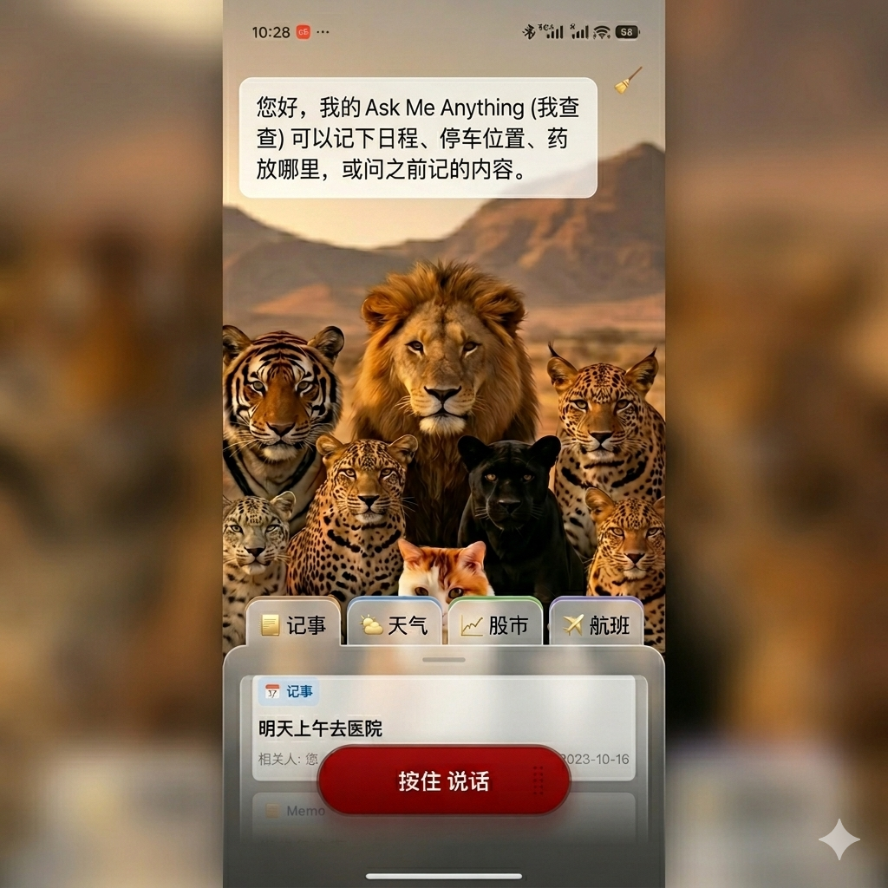

# LoongClaw for Android

**[中文 README](README.md)** · **v2.1.3** · Android client

> **Note for English readers**
>
> This document is a **machine-translated draft** and may lag behind [README.md](README.md) (Chinese, canonical). A full sync is planned later; corrections welcome via issues.
>
> **Partial English UI**: **Settings → Language → English** localizes Settings, file upload, and My Files. Connection banners, main chat chrome, and assistant replies may still be **Chinese**. Full English UI is planned for a future release.

Connect to your home or cloud **OpenClaw Gateway** to chat, view MODAL whiteboards, hear TTS, and download files generated on the Gateway. Semantics and multimodal content are handled by the Gateway; the App handles connection and rendering.



---

## Features

| | |
|---|---|
| **Chat** | WeChat-style input bar; streaming replies; local chat history |
| **MODAL whiteboard** | Tables, Markdown, WebView pages; bottom tabs (up to 6) |
| **Maps** | Gateway Canvas + one-tap open in Amap (China) |
| **Files** | Upload to Gateway; save images/PDF to `Download/LoongClaw/` |
| **TTS** | Read aloud assistant replies (toggle in Settings) |
| **Connection** | Gateway address + Token/password in-app; **step-by-step handshake** (error hints may be Chinese) |
| **Background keep-alive** | **Foreground Service** + notification after Save & Connect; WebSocket kept when screen off (see [Keep-alive](#keep-alive--notifications)) |

Built for **self-hosted OpenClaw Gateway** on Android (recommended: **Tailscale** + manual address entry). Install Gateway companion skills/resources as described below.

---

## UI language (v2.1.3)

**Settings → Language** offers **中文 | English** (single-row toggle); the UI refreshes after you switch.

**Localized in v2.1.3**

- Settings (Gateway fields, four-step handshake, Save / Test buttons)
- Add attachment sheet and composer placeholder
- **My Files** list and delete confirmation

**Still Chinese (known limits)**

- Main chat title, welcome message, clear-history dialog
- Connection error banner and Toast hints
- Assistant replies from Gateway (Agent / skill content)

Full English UI is planned for a later release.

---

## Quick start

### 3.1 Self-hosted Gateway (home PC + Tailscale) — recommended

Gateway runs on your PC or NAS; phone reaches it over Tailscale.

1. Install [OpenClaw](https://github.com/openclaw/openclaw) on the Gateway host and run `openclaw gateway`.
2. Install companion resources (**at minimum** the [littlehelper-modal](scripts/skills/littlehelper-modal/SKILL.md) skill; full bundle: [Gateway Companion Bundle plan](docs/GATEWAY_COMPANION_BUNDLE_PLAN.md), Release provides `loongclaw-gateway-bundle` zip).
3. Install **Tailscale** on the phone (same tailnet as the host).
4. Install this App (see [§3.3 Build](#33-build-from-source) or a Release APK).
5. **First launch** opens **Settings** automatically (**no** background Gateway connection and **no** pairing request until you save).
6. Fill in connection info:
   - **Server address**: host Tailscale IP (e.g. `100.x.x.x`) or LAN IP (empty on first install)
   - **Port**: default `18789`
   - **Auth**: default **Token**; same as `gateway.auth` in `openclaw.json`
7. Tap **Test handshake**: four-step progress (Token → pairing → approval → connect); approve in Control UI if prompted, then test again.
8. Tap **Save & Connect** (main screen starts the long-lived connection).
9. If pairing is required: Control UI **Nodes → Devices** → approve; expand **Show device ID** to match.
10. On success the App connects to **`agent:main:main`**. A **Gateway connection** notification appears; set battery to **Unrestricted** for this app on aggressive OEM ROMs.

> **QR scan**: grey placeholder in Settings; **not supported** in this version.

### 3.2 Cloud Gateway (VPS + public network)

> Public `wss://` is **not supported** in this version (mainline: Tailscale / LAN `ws://`).

1. Install OpenClaw Gateway on VPS; configure `gateway.auth` (Token recommended).
2. Install companion skills (same as §3.1).
3. Install App → **Settings** → public **address**, **port** `18789`, **Token/password** (`ws://`).
4. **Test handshake** → **Save & Connect**; approve device in Control UI on first connect.

### 3.3 Build from source

```bat
git clone <this-repo>
cd LittleHelper
copy local.properties.example local.properties
:: Edit local.properties: set sdk.dir at minimum
gradlew.bat assembleDebug
adb install -r app\build\outputs\apk\debug\app-debug.apk
```

- Gateway address, Token, and password are stored **only in the App** (encrypted); not baked into the APK.
- Session is fixed to **`agent:main:main`**.

Unit tests: `gradlew.bat testDebugUnitTest`

---

## Connection settings

### Storage and first launch

| Behavior | Description |
|----------|-------------|
| **Where config lives** | Encrypted local storage after **Save** in Settings |
| **`local.properties`** | Only `sdk.dir` for building; **not** Gateway credentials |
| **Fresh install** | Settings opens automatically; **no** background connect |
| **Defaults** | Port `18789`, auth **Token**; address/credentials empty until you fill them |
| **When connected** | After **Save & Connect**: WebSocket + foreground Service |
| **Test handshake** | Short-lived test connection; four-step UI only |

### Keep-alive & notifications

After Save & Connect:

- **WebSocket** stay-alive (idle = heartbeat only; **no LLM token burn**)
- Low-priority notification: connecting → connected
- Main screen **green** = online; **orange blink** = connecting

**Tip (OEM ROMs)**: Settings → Apps → LoongClaw → Battery → **Unrestricted**.

Details: [docs/DEVELOPER.md](docs/DEVELOPER.md).

### Settings ↔ Gateway config

| Setting | Maps to |
|---------|---------|
| Protocol | WebSocket (fixed) |
| Auth mode | `gateway.auth.mode` |
| Server address | Reachable host for `gateway.bind` |
| Port | `gateway.port` (default `18789`) |
| Token / password | `gateway.auth.token` or `.password` |

### Test handshake · four steps

```
═══════ Device handshake ═══════
① Token check
② Device pairing
③ Approval check
④ Connect
```

Built-in (not shown in Settings):

| Item | Value |
|------|-------|
| `client.id` | `openclaw-android` |
| `client.mode` | `ui` |
| `role` | `operator` |
| Session key | `agent:main:main` |
| Canvas / upload | `http://{host}:18789` / `:18889` |

Handshake design: [openclaw_client_handshake_guide.md](docs/openclaw_client_handshake_guide.md).

### Gateway session

Release builds connect to **`agent:main:main`** (Gateway default agent `main`).

```
WebSocket connect (hello-ok)
  → sessions.messages.subscribe
  → chat.send
  → receive chat.delta, session.message
```

Contract: [docs/OPENCLAW_GATEWAY_CONTRACT.md](docs/OPENCLAW_GATEWAY_CONTRACT.md) §1.

---

## Architecture

```
┌─────────────┐   WebSocket    ┌──────────────────┐
│ LoongClaw   │ ◄──────────► │ OpenClaw Gateway │
│ chat+board  │ chat.send +  │ Agent+Canvas     │
│             │  subscribe   │                  │
└─────────────┘              └──────────────────┘
```

MODAL wire (no `===END===`):

```
===CHAT===
One-line summary

===MODAL===
{"action":"open","blocks":[...]}
```

Full schema: [docs/OPENCLAW_GATEWAY_CONTRACT.md](docs/OPENCLAW_GATEWAY_CONTRACT.md)

---

## Project layout

```
LittleHelper/
├── app/                    # Android (Kotlin + Compose)
├── docs/                   # Contract, handshake, developer docs
├── gateway-bundle/         # Companion bundle source (Release zip)
├── scripts/                # Gateway scripts & skills
├── README.md               # Chinese user guide
├── README.en.md            # This file
└── CHANGELOG.md
```

---

## FAQ

**Stuck on “connecting”**  
Check address/port, Tailscale/LAN, Gateway running, firewall. Use **Test handshake** to see which step fails.

**Persistent “Gateway connection” notification**  
Normal after Save & Connect (foreground Service). Tap to return to the app.

**Disconnected after screen off**  
Set battery to **Unrestricted**; some devices still kill the app — reopen to auto-reconnect.

**Pairing required**  
Control UI → Devices → approve; match **device ID** from Settings or the top banner.

**No reply after sending a message**  
Ensure Save & Connect succeeded and Gateway is running; retry handshake or restart the app.

**Whiteboard missing, text only**  
Gateway must send `===MODAL===` with valid JSON; no `===END===`. See contract §2.

**Chat history gone**  
Stored in app private storage; cleared on uninstall or clear data.

## Known limitations (v2.1.3)

| Area | Status |
|------|--------|
| **UI language** | Settings, upload, and My Files support English; connection banners, main chat chrome, and handshake error hints may stay **Chinese** |
| **Public `wss://`** | Not supported; use Tailscale or LAN `ws://` |
| **QR scan in Settings** | Placeholder only; manual Token + Control UI pairing |
| **Multi-agent UI** | Code retained; Settings fixes session to `agent:main:main` |
| **Map canvas** | App renders map MODAL; bundle does **not** ship `map.littlehelper.html` |
| **Gateway host OS** | Companion bundle targets **Windows** only for v2.1.x |
| **Release signing** | GitHub Release APK may use debug signing unless you configure a release keystore |

More: [docs/DEVELOPER.md](docs/DEVELOPER.md)

---

## Contact

Feedback and questions: **[laomianhua@agent.qq.com](mailto:laomianhua@agent.qq.com)**

---

## License

This project is licensed under the **[MIT License](LICENSE)**.

- You may use, modify, and redistribute this code (including commercially), provided the copyright notice and license text are included.
- **LoongClaw** is an independent community client, **not affiliated with** the [OpenClaw](https://github.com/openclaw/openclaw) project. OpenClaw and related names are trademarks of their respective owners.

### Disclaimer

- The software is provided **“AS IS”**, without warranty of any kind, including merchantability, fitness for a particular purpose, or ongoing compatibility with your Gateway.
- The App connects to a **self-hosted OpenClaw Gateway** that you configure. You are responsible for Gateway endpoints, tokens, API keys, and data processed on the server.
- To the maximum extent permitted by law, the author is **not liable** for any damages arising from use or inability to use this software.
- Do not commit API keys or Gateway tokens to public repositories.

History: [CHANGELOG.md](CHANGELOG.md)
