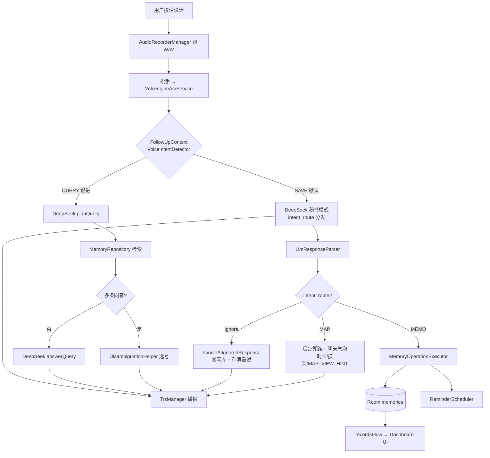

# 语音小帮手（LittleHelper）

**当前版本：2.0**（`versionCode` 2 · `versionName` 2.0）

面向普通用户的极简语音记事 Android 应用。用户**按住说话、松开发送**即可**记下**日程、生日、停车位置、物品存放等信息，或**查询**之前记过的内容；也可直接问**路线、通勤时间、地点位置**等地图问题——结果以**聊天气泡**为主（时长、换乘指引），需要时手动打开「地图」标签查看路线。语音采用**整轨录音 + 火山引擎（Volcengine）云端 ASR** 识别，理解与决策由 DeepSeek 大模型完成，数据保存在本机 SQLite（Room），无需登录、无需云端账号。底部抽屉支持 **记事本 / 高德地图** 标签切换，AI 通过顶层 **intent_route** 自动路由到对应模块。

> **v1.0 → v2.0**：在语音记事核心之上，完整落地高德地图模块（查地点 / 附近推荐 / 路线规划）、协议先行架构清洗，以及面向全网的通用文案与提醒待办联动完成。

---

## 目录

- [功能概览](#功能概览)
- [快速开始](#快速开始)
- [Dashboard 记忆卡片](#dashboard-记忆卡片)
- [对话记录管理](#对话记录管理)
- [多层抽屉与高德地图](#多层抽屉与高德地图)
- [AI 意图路由协议](#ai-意图路由协议)
- [界面与交互设计](#界面与交互设计)
- [使用说明与示例话术](#使用说明与示例话术)
- [架构设计](#架构设计)
- [AI 集成与 DB_OPS 协议](#ai-集成与-db_ops-协议)
- [status=ignore 拒绝协议](#statusignore-拒绝协议)
- [本地数据库](#本地数据库)
- [同音字与人名消歧](#同音字与人名消歧)
- [AI 自我纠错与确认轮加固](#ai-自我纠错与确认轮加固)
- [本地兜底机制（已移除）](#本地兜底机制已移除)
- [语音识别（ASR）](#语音识别asr)
- [语音播报（TTS）](#语音播报tts)
- [提醒通知](#提醒通知)
- [项目结构](#项目结构)
- [技术栈与依赖](#技术栈与依赖)
- [开发与测试](#开发与测试)
- [权限说明](#权限说明)
- [重构与修复历史](#重构与修复历史)
- [v2.0 版本摘要](#v20-版本摘要)
- [已知限制与后续方向](#已知限制与后续方向)

---

## 功能概览

### 核心能力

| 能力 | 说明 |
|------|------|
| **语音记下** | 默认 SAVE 路径，AI 秘书理解后输出结构化写库指令，App 执行 insert/update/delete |
| **语音查询** | 用户问「之前记过的内容」时走查询路径：本地检索 → AI 口语化回答；**新 utterance 默认 SAVE**，由云端 JSON 决定 MAP 或 MEMO |
| **多轮对话** | 信息不完整时 AI 温柔追问（如缺日期）；用户短答「1月1号」「下午两点」即可补充 |
| **同音字处理** | 王纲/王刚、夏子涵/夏子杭等同音不同字：支持改字更正、新增第二人、查询时选号消歧 |
| **删除与更正** | 用户说「删除」「不是…是大纲的纲」等，AI 输出带 id 的 update/delete；可一次删多条 |
| **全局清空** | 用户明确「全部删掉/清空所有记录」时 AI 输出 `clear_all`，App 弹窗二次确认后执行 |
| **本地提醒** | 带日期的记录在约定时刻推送通知（默认当天 8:00；含 `event_time` 则精确到分钟，如「10 分钟后提醒我」） |
| **模糊拒绝** | 用户话语无法理解时，AI 返回 `status=ignore`，App 拦截、TTS 引导重说、按钮变为【按住 重说】，零脏数据入库 |
| **重要等级** | AI 自动判定 `importance_level`（`normal` / `important` / `critical`），卡片以徽章与底色区分，标题不拼接「（紧急）」等后缀 |
| **记录类型** | AI 输出 `type`（`todo` / `event` / `note` / `birthday` / `general`），Dashboard 卡片展示对应标签 |
| **待办勾选** | `type=todo` 时右侧 Checkbox → `toggleTodoDone()` 本地更新 `done`；**每日循环待办**在 0 点自动恢复未勾选 |
| **提醒后完成待办** | 点通知进 App 后说「吃完了」等 → 自动绑定 `pendingReminderTodoId`，直接勾选对应待办（2 小时窗口），无需误进药名消歧 |
| **记忆卡片管理** | 下半屏 Dashboard 实时展示 Room 记录；长按卡片可本地删除单条记忆 |
| **对话记录管理** | 长按单条聊天气泡可删除；右上角 🧹 长按可清空全部对话（保留欢迎语，欢迎语也可单删） |
| **多层抽屉** | 底部玻璃面板含 **记事本 / 地图** 标签切换；聊天区与红宝石按钮各模块共享；架构可扩展更多抽屉 |
| **高德地图** | 底部抽屉「地图」标签内嵌 3D 地图；**语音查路线不自动弹出抽屉**，结果以聊天气泡为主，用户手动切标签查看 |
| **每日待办重置** | 每日 0 点自动清除「循环提醒 + 待办」的 `done` 勾选（如每天吃药）；关机漏跑则下次启动补跑 |

### 界面与交互设计（概览）

- **上半屏**：玻璃风聊天气泡流（可滚动），**各抽屉模块共享**，自动滚到最新消息
- **下半屏**：可拖拽 `BottomSheet` 玻璃抽屉（展开约 **72%** 屏高，**启动时默认收起** peek ≈ **160dp**）
  - 抽屉内 **标签栏**：`记事本`（记忆卡片列表）| `地图`（高德地图）
  - 标签切换带淡入淡出动画；默认选中「记事本」
- **底部悬浮**：红宝石拟物对讲机按钮（按住说话 / 松开发送），不随抽屉位移
- **背景**：**全透明沉浸式背景（直接透出手机桌面壁纸）** + 半透明玻璃卡片
- **零闪屏**：启动瞬间直接透出桌面，无过渡动画
- **误触过滤**：按住不足 500ms 视为误触，提示「录音时间太短」，不上传 ASR

按钮文案随状态变化：

| 状态 | 按钮文字 |
|------|----------|
| 空闲 | 按住 说话 |
| 录音中 | 松开 发送 |
| 上传识别中 | 发送中…（禁用） |
| AI 处理中 | 请稍候…（禁用） |
| 播报中 | 按住 补充（可打断 TTS） |
| AI 追问日期/时间 | 按住 回答 |
| AI 追问是否记下（SAVE 确认轮） | 按住 确认 |
| 等同音记录选号 | 按住 选号 |
| AI 明确拒绝（status=ignore） | 按住 重说 |

- **TTS 播报高亮**：助手正在播报的气泡淡黄底 + 加粗，便于对照听读

欢迎语：*「您好，我是语音小帮手。您可以记下日程、停车位置、物品存放，或问我之前记过的内容。」*

---

## 快速开始

### 1. 配置 API Key

复制 `local.properties.example` 为 `local.properties`（该文件已在 `.gitignore` 中，不会提交）：

```properties
sdk.dir=C\:\\Users\\你的用户名\\AppData\\Local\\Android\\Sdk
DEEPSEEK_API_KEY=sk-你的密钥

# 火山引擎 ASR（一句话识别）
VOLC_APPID=你的AppId
VOLC_TOKEN=你的Token
VOLC_CLUSTER=volcasr_default

# 高德地图 Android SDK（须为 Android 平台 Key，非 Web 服务 Key）
# 包名 com.littlehelper；SHA1 获取：.\gradlew signingReport
AMAP_API_KEY=你的Android_SDK_Key
```

- `DEEPSEEK_API_KEY` → `BuildConfig.DEEPSEEK_API_KEY`，由 `DeepSeekService` 读取
- `VOLC_*` 三个字段 → `BuildConfig`，由 `VolcengineAsrService` 读取
- `AMAP_API_KEY` → `BuildConfig.AMAP_API_KEY` + Manifest `meta-data`，由 `AMapServiceImpl` 读取
- 未配置 DeepSeek 时 App 提示：*「请先在 local.properties 配置 DEEPSEEK_API_KEY」*
- 未配置火山 ASR 时识别会失败并提示配置 `VOLC_APPID / VOLC_TOKEN / VOLC_CLUSTER`
- 高德 Key 须在高德开放平台绑定包名 `com.littlehelper` 与调试/发布 SHA1；未配置或鉴权失败时地图可能白屏

### 2. 编译安装

```bat
cd d:\Dev\LittleHelper
gradlew.bat assembleDebug
adb install -r app\build\outputs\apk\debug\app-debug.apk
```

### 3. 运行单元测试

```bat
gradlew.bat testDebugUnitTest
```

测试报告：`app/build/reports/tests/testDebugUnitTest/index.html`

### 4. 调试语音识别

火山 ASR 相关日志可在 Logcat 中按包名或 `VolcengineAsrService` 过滤。录音文件为缓存目录下的临时 `.wav`，识别结束（成功或失败）后会在 `finally` 中删除，不占用手机存储。

```bat
adb logcat -s LittleHelperSTT
```

---

## Dashboard 记忆卡片

下半屏 **记忆 Dashboard** 通过 `recordsFlow`（Room `Flow`）实时驱动，与上半屏对话流解耦。

### 卡片展示

| 元素 | 说明 |
|------|------|
| **类型标签** | 根据 `type` 显示：📌 待办 / 📅 事件 / 📝 备忘 / 🎂 生日 / 💬 通用 |
| **重要徽章** | `critical` → ❗ 浅红底；`important` → ⭐；`normal` → 无图标（素雅） |
| **摘要** | 展示 `summary`，**不**在标题后拼接「（紧急）」「（重要）」 |
| **相关人** | 有 `person` 时展示；缺省主语由 AI 填「您」 |
| **时间** | 卡片角标展示创建时间 |

### 交互

| 操作 | 行为 |
|------|------|
| **待办勾选** | `type=todo` 时右侧 Checkbox → `toggleTodoDone()` 本地更新 `done`；完成后置灰 + 删除线 |
| **长按删除** | 弹出「确定要删除这条记录吗？」→ 确认后 `deleteRecord()` 本地删除，列表即时刷新 |
| **拖拽抽屉** | `BottomSheetScaffold`：展开约 **72%** 屏高；收起时露出拉条与首张卡片边缘（peek ≈ **160dp**） |
| **所在抽屉** | 记忆列表位于底部 **「记事本」** 标签页内；与「地图」标签切换互不影响聊天区 |

> Dashboard 操作**仅改本地数据库**，不经过 DeepSeek，不触发 TTS。

---

## 对话记录管理

上半屏聊天气泡保存在 `MainViewModel` 的内存状态 `MainUiState.messages` 中，**不写入 Room**，与下半屏记忆卡片完全隔离。

| 操作 | 触发方式 | 行为 |
|------|----------|------|
| **单条删除** | 长按任意聊天气泡（含欢迎语） | 确认后 `deleteChatMessage(id)`，从列表移除 |
| **一键清空** | 长按右上角 🧹 扫把图标 | 确认「是否删除当前所有对话？」→ `clearChatMessages()` |
| **欢迎语保留规则** | 一键清空时 | 若第一条仍为系统欢迎语（含「我是语音小帮手」），**仅保留该条**，其余全部清空 |
| **欢迎语可单删** | 长按欢迎语气泡 | 与普通过话相同，可彻底删除；删后一键清空不会再「复活」欢迎语 |

> 说「删除聊天记录」等**不会**被 App 语音拦截；清空对话请用 UI 操作，避免与 AI「删除记忆」意图混淆。

---

## 多层抽屉与高德地图

第八阶段增量功能：在保留语音记事核心的前提下，引入 **可扩展的多层抽屉堆栈** 与 **高德 3D 地图**（详见 [`docs/designDoc.md`](docs/designDoc.md)）。

### 交互结构

```
┌─────────────────────────────────┐
│  共享聊天区（记事本 / 地图共用）   │
├─────────────────────────────────┤
│  磨砂玻璃 BottomSheet 抽屉        │
│  ┌──────────┬──────────┐        │
│  │ 📝记事本  │ 🗺️地图   │        │
│  └──────────┴──────────┘        │
│  [当前标签内容区]                 │
│      🔴 按住 说话（全局悬浮）      │
└─────────────────────────────────┘
```

| 元素 | 说明 |
|------|------|
| **记事本** | 原记忆 Dashboard（`recordsFlow` + `DashboardCard`），默认选中 |
| **地图** | 高德 3D 地图；右上角可切换 **标准 / 卫星** |
| **定位** | 首次进入地图标签时申请 `ACCESS_FINE_LOCATION`；允许后显示蓝点 |
| **镜头策略** | **查具体地点**（`VIEW_LOCATION`）：镜头停在目标 POI，蓝点仅显示不跟拍；**我在哪 / 附近推荐**（`LOCATION` / `POI_SEARCH`）：蓝点可跟拍当前位置 |
| **VIEW_LOCATION 标针** | 红针 + 信息窗；打开地图抽屉时 `displayPoiMarkers` 重新飞到目标坐标 |
| **附近推荐蓝卡** | 仅 `POI_SEARCH`（`distanceMeters > 0`）时在地图抽屉底部显示「附近推荐」大字列表；`VIEW_LOCATION` **不显示**蓝卡，以红针 + 聊天气泡为准 |
| **查地名失败** | 高德无结果或 POI 标题与关键词不相关 → 聊天区中性认错气泡 + TTS（如「地图上没有找到「xxx」，请换个说法再试。」） |
| **拒绝定位** | Toast 提示，地图仍可用（默认北京），不闪退 |
| **省电** | 切离地图标签或 App 退后台时 `onPause` + 关闭定位蓝点（`MapCard` 内 `DisposableEffect` 绑定 `currentCard`） |
| **手势隔离** | `sheetSwipeEnabled = false`；仅顶部拖柄 + 标签栏区域可拉高/折叠抽屉；地图画布内 `requestDisallowInterceptTouchEvent` 锁死平移/缩放 |
| **语音查地图** | 不自动切换标签、不自动展开抽屉；后台算路画线，聊天气泡播报时长/换乘，并提示「您可以打开地图卡片查看」 |

### 架构隔离（零污染）

| 层级 | 路径 | 职责 |
|------|------|------|
| 领域接口 | `domain/map/IMapService.kt`、`MapType.kt` | 纯 Kotlin 抽象，**无** `com.amap` 依赖 |
| SDK 实现 | `data/map/AMapServiceImpl.kt` | **唯一**允许 `import com.amap.*` 的文件 |
| 工厂 | `data/map/MapServiceFactory.kt` | UI 只依赖 `IMapService` |
| 堆栈 UI | `presentation/stack/` | `CardStackManager`、`DrawerTabBar`、`DrawerCard` |
| 地图卡片 | `presentation/mapview/MapCard.kt` | Compose + `AndroidView` 嵌入 `MapView` |

扩展新模块（如股市、航班）：在 `DrawerCard` 枚举追加条目，实现对应 Composable，调用 `CardStackManager.addCardToStack()` 即可。

### 高德 SDK 依赖

- Gradle：`com.amap.api:3dmap-location-search:10.1.500_loc6.5.0_sea9.7.4`（3D 地图 + 定位合包）
- NDK：`armeabi-v7a`、`arm64-v8a`
- Maven：除 `mavenCentral()` 外使用阿里云镜像以稳定拉取依赖

---

## AI 意图路由协议

第九阶段起：在**不破坏**原有 `operations` 写库结构的前提下，于 DB_OPS JSON **顶层**追加 `intent_route`、`action`、`payload`。第十阶段完成 **协议先行大清洗**——废除一切本地汉字意图字典与宿主兜底造 JSON，云端 Few-Shot + 标准 payload 枚举为唯一语义来源。

### 设计铁律：协议先行、App 愚蠢

| 层级 | 职责 | 禁止 |
|------|------|------|
| **云端 DeepSeek** | 理解 ASR 文本、提取参数、输出 `intent_route` + payload JSON + 口语回复 | — |
| **App 解析层** | `LlmResponseParser` 解析 JSON；`VoiceIntentDetector` 仅读 `FollowUpContext` UI 状态 | 对用户原话做汉字意图猜测 |
| **App 执行层** | MAP → 画线/切图层；MEMO → Room 写库 | SDK 回调向聊天气泡追加语义文案 |

> 已移除：`MapInstructionFallback`（本地从原话拼 MAP JSON）、`MapTravelMode` 字符串猜测、`VoiceIntentDetector` 内全部 nav/query 关键词表。

### 顶层 JSON 契约

```json
___DB_OPS_START___
{
  "status": "success",
  "intent_route": "MEMO | MAP | WEATHER | STOCK",
  "action": "CREATE | SEARCH | NAVIGATE | VIEW_LOCATION | null",
  "payload": { },
  "operations": []
}
___DB_OPS_END___
```

| 字段 | 说明 |
|------|------|
| `intent_route` | 模块路由：`MEMO`（记事，默认）、`MAP`（地图）、`WEATHER` / `STOCK`（预留） |
| `action` | 模块内动作；纯记事可 `null` |
| `payload` | 各模块结构化参数；无参数时 `null` |
| `operations` | **原有**数据库操作数组；纯地图查询时**必须**为 `[]` |

### 地图模块（MAP）

**场景 A — 查看地点（`VIEW_LOCATION`）**：「北京协和医院在哪里」「帮我找一下颐和园」

```json
{
  "status": "success",
  "intent_route": "MAP",
  "action": "VIEW_LOCATION",
  "payload": {
    "keywords": "北京协和医院",
    "city": "北京市",
    "zoom_level": 16
  },
  "operations": []
}
```

- 与 `POI_SEARCH` **物理隔离**：具体机构/远方地标必须走 `VIEW_LOCATION`，禁止误路由至以 GPS 为中心的附近检索
- App 端 `MapPoiRelevance` 校验高德首条 POI 是否与 `keywords` 相关，拦截「冥王星医院 → 天王星商务大厦」类模糊误匹配
- 成功：SDK 生成 `locationAnnouncement`（「已经为您在地图上标出…」）；失败：聊天认错，不标错点

**场景 A2 — 地图控制（`MAP_CONTROL`）**：

| `query_type` | 典型话术 | App 行为 |
|--------------|----------|----------|
| `LOCATION` | 「我在哪」「看我的位置」 | 蓝点跟拍 + 镜头居中当前 GPS |
| `CLEAR` | 「清掉路线」「擦掉地图」 | 清除路线/标记，恢复默认跟拍 |
| `POI_SEARCH` | 「附近有什么好吃的」「周边超市」 | 以 GPS 为中心半径 3km 检索；地图抽屉「附近推荐」蓝卡 + 红针 |

**场景 B — 路径/通勤（`NAVIGATE`）**：「现在开车去机场要多久」

```json
{
  "status": "success",
  "intent_route": "MAP",
  "action": "NAVIGATE",
  "payload": {
    "origin": "CURRENT_LOCATION",
    "destination": "北京首都国际机场",
    "mode": "DRIVING",
    "query_type": "DURATION"
  },
  "operations": []
}
```

> `origin` 默认为 `CURRENT_LOCATION`；宿主收到后用高德 SDK 当前 GPS 经纬度替换。

### MAP payload 原子字段（`MapInstructionPayload` + `MapProtocol.kt`）

与高德 **PoiSearch / GeocodeSearch / RouteSearch / MapType** 严格对齐；云端 JSON 必须使用下列 wire 值，App 仅 `fromWire` 解析后映射 SDK。

| Key | wire 枚举 / 格式 | 高德 SDK 映射 |
|-----|------------------|---------------|
| `origin` | `"CURRENT_LOCATION"` 或地名 | 蓝点 GPS / PoiSearch→GeocodeSearch |
| `destination` | 纯文本地名（如 `"天安门"`） | PoiSearch → GeocodeSearch → 坐标 |
| `mode` | `DRIVING` \| `WALKING` \| `BICYCLING` \| `TRANSIT` | `RouteSearch.calculate*RouteAsyn` |
| `query_type` | `DURATION` \| `DISTANCE` \| `ROUTE_PLAN` \| `ROUTE_DETAIL`（NAVIGATE）；`LOCATION` \| `CLEAR` \| `POI_SEARCH`（MAP_CONTROL） | 路径维度或地图控制类型 |
| `layer_type` | `STANDARD` \| `SATELLITE` | `AMap.mapType` |
| `keywords` | POI 名 / 类别词 | VIEW_LOCATION：机构全名；POI_SEARCH：美食/超市/公厕等 |
| `city` | 可选城市 | GeocodeSearch / PoiSearch 城市限定 |
| `zoom_level` | Int（兼容 `zoomLevel`） | VIEW_LOCATION 镜头缩放 |

法定枚举类：`MapRouteMode`、`MapQueryType`、`MapLayerType`；常量：`MapOrigin.CURRENT_LOCATION`。

### 聊天气泡与 TTS 分工（地图）

- **AI 口语**：地图意图的默认聊天气泡来源；MAP 指令延迟 TTS，等 SDK 算路后再播报。
- **SDK 实时时长**：驾车/公交等算路成功后，`MapExecuteResult.durationAnnouncement`（如「当前开车大约需要 12 分钟」）更新最新 AI 气泡并 TTS。
- **`[CALCULATING]` 占位符**：AI 显式授权时，SDK 数值片段替换占位符。
- **公交换乘详情**（`query_type=ROUTE_DETAIL`）：提取后作为**永久**助手聊天气泡（`💡 换乘指引`）
- **查看地图引导**：算路或查点完成后主回复追加 `您可以打开地图卡片查看。`（`MainViewModel.MAP_VIEW_HINT`），用户自行点「地图」标签
- **VIEW_LOCATION 成功/失败**：成功由 SDK `locationAnnouncement` 更新气泡；失败由 `failureMessage` 追加聊天认错（不标错点、不显示蓝卡）
- **画线前清图层**：每次新路径规划前 `aMap.clear()`，避免多轮对话路线叠加
- **后台算路**：`mapExecutionToken` 触发 `LaunchedEffect`，静默 `initialize` SDK；抽屉保持当前标签

### 云端 Few-Shot（`DeepSeekService.SECRETARY_SYSTEM_PROMPT`）

常见口语示例（开车去机场、坐地铁、公共交通、步行多远、看地图、未来时段通勤等）已全部作为 Few-Shot 写入 System Prompt，由大模型泛化理解，**不在 App 本地维护任何对照表**。

### 宿主分发链（`MainViewModel`）

```
DeepSeek 秘书回复 → LlmResponseParser.parseDbOpsBlock
        ↓
intent_route == MAP ?
   ├─ 是 → mapExecutionToken++ → 后台 IMapService.executeInstruction
   │        聊天气泡：时长 + MAP_VIEW_HINT（不自动切抽屉/不自动展开）
   └─ 否 → activeDrawerCard 保持当前标签
            ├─ action=QUERY_TODO / UPDATE_TODO_STATUS → 待办消歧链
            └─ 否则 → executeMemoryChanges(operations)
```

### 记事本待办消歧（NOTEBOOK / MEMO + `action`）

云端无法直接改库时，通过 **action + payload**（`operations=[]`）驱动 App 本地三阶段闭环：

| Action | App 行为 |
|--------|----------|
| `QUERY_TODO` | `payload.query_keyword` → Room 查 `type=todo AND done=0`；0 条播报未找到；1 条静默二次请求 AI；多条追问并注入隐式上下文 |
| `UPDATE_TODO_STATUS` | `payload.todo_id` 或 `todo_keyword` + `status=COMPLETED` → 更新 `done=true`，Dashboard 划删除线 |

相关类型：`domain/todo/TodoProtocol.kt`（`NotebookAction`、`TodoActionPayload`）；`FollowUpContext.TODO_DISAMBIGUATION`；`data/todo/TodoContextBuilder.kt`。

```
用户：「吃过药了」→ AI: QUERY_TODO(keyword=吃药)
  → App 查库 → 多条 → TTS 追问 + 注入 [{id,title}] 给下一轮
  → 用户：「早上的那个」→ AI: UPDATE_TODO_STATUS(todo_id=101)
  → App: done=true + TTS 确认
```

相关类型（地图）：`domain/map/IntentRoute.kt`、`MapProtocol.kt`、`MapInstructionPayload.kt`、`MapExecuteResult.kt`、`MapPoiRelevance.kt`、`MapTtsAuthorization.kt`；助手追问：`network/AssistantFollowUpDetector.kt`。

### 语音入口（零本地语义猜测）

```kotlin
// VoiceIntentDetector.kt — 全文逻辑
fun detect(followUpContext: FollowUpContext): VoiceAction = when (followUpContext) {
    FollowUpContext.QUERY -> VoiceAction.QUERY
    FollowUpContext.DELETE,
    FollowUpContext.SAVE,
    FollowUpContext.TODO_DISAMBIGUATION,
    FollowUpContext.NONE -> VoiceAction.SAVE
}
```

- **SAVE（默认）**：所有新 utterance 进入 `processWithSecretary` → DeepSeek 输出 DB_OPS → 按 `intent_route` / `action` 分发。
- **QUERY**：仅当 UI 已置 `FollowUpContext.QUERY`（同音选号等跟进）时，走本地 `queryMemory` 检索链。
- **TODO_DISAMBIGUATION**：待办多条命中后的跟进轮，仍走 SAVE → 秘书（携带查库隐式上下文）。
- **助手追问识别**：`AssistantFollowUpDetector` 匹配 App 自身生成的固定追问模板，用于设置 `FollowUpContext`，**不解析用户说了什么**。

### 秘书提示词加固要点

在 `DeepSeekService.SECRETARY_SYSTEM_PROMPT` 中追加：

1. **中枢调度**：路线、时间、距离、「开车去…要多久」、查看位置 → `intent_route = "MAP"`
2. **纯地图不写库**：MAP 动作时 `operations` 必须为 `[]`
3. **记事向下兼容**：日程/备忘等 → `intent_route = "MEMO"`，`operations` 照旧 insert/update/delete

---

## 界面与交互设计

### 布局层级

```
Box（全透明背景，透出系统壁纸）
├── BottomSheetScaffold（初始状态：PartiallyExpanded，peek ≈ 160dp）
│   ├── sheetContent：玻璃风抽屉面板（≈72% 屏高）
│   │   ├── DrawerTabBar（记事本 | 地图）
│   │   └── AnimatedContent：NotebookDrawerContent 或 MapCard
│   └── content：上半屏聊天气泡 LazyColumn（各抽屉共享）
├── VoiceHoldButton（底部居中悬浮，红宝石对讲机造型）
└── 🧹 清空对话入口（右上角，长按触发）
```

### 红宝石对讲机按钮

- 尺寸 240×76dp，圆角胶囊；金属色外圈 + 红宝石纵向渐变 + 右侧扬声器微孔（Canvas 绘制）
- 按住时 `scale` 缩至 0.94、`elevation` 降低，松手弹簧回弹
- **按住** → `AudioRecorderManager.start()`；**松开** → `stop()` 并自动上传火山 ASR（无需二次点发送）
- 短按 &lt; 500ms → 取消录音并 Toast「录音时间太短」

### 玻璃风卡片

- 聊天气泡与 Dashboard 卡片：`Color.White.copy(alpha = 0.75f)` 背景 + 0.5dp 白色高光边框
- `critical` 记忆卡片：浅粉红底与边框强调

---

## 使用说明与示例话术

### 记下

```
「夏子涵的生日是6月8号」
「车停在 B2 区 128 号」
「降压药放在厨房左边第二个抽屉」
「明天下午要去医院复查」
「后天上午去商场，下午去医院」（一句多安排 → AI 应输出多个 insert）
「10 分钟后提醒我」
```

AI 若觉得信息不够，会追问；此时按钮变为 **「按住 回答」** 或 **「按住 确认」**，短说即可：

```
「下午两点」
「1月1号」
「好的，记上吧」
「是的」
```

### 问时间与相对提醒

```
「现在几点？」
「今天几号？」
「10 分钟后提醒我」
```

每次请求 DeepSeek 前，App 会将**手机当前日期与时刻**（`SystemTimeContext`）注入 system prompt 顶部，供 AI 推算「后天」「10 分钟后」等并填入 `event_time`。

### 查询（记忆库）

```
「夏子涵生日是哪天？」
「车停哪儿了？」
「药放哪里了？」
```

> 新 utterance 默认走 SAVE → 云端秘书；仅当 App 已置 `FollowUpContext.QUERY`（如选号跟进）时才走本地 `queryMemory`。

### 地图（路线 / 位置）

由 AI 输出 `intent_route="MAP"`，App **后台算路或查点**，结果在**聊天气泡**呈现；**不自动弹出地图抽屉**，用户可手动点「地图」标签查看：

```
「现在开车去机场要多久？」
「坐地铁去西单怎么走？」
「步行到颐和园有多远？」
「北京协和医院在哪里？」
「附近有什么好吃的？」
```

- **查远方地点**：聊天说明 + 地图红针（无底部蓝卡）
- **附近推荐**：聊天说明 + 地图「附近推荐」蓝卡（距红按钮上方留白，避免遮挡）

典型回复结构：

```
好的，我帮您查一下地铁路线。
当前乘坐公共交通大约需要 45 分钟
您可以打开地图卡片查看。

💡 换乘指引        ← query_type=ROUTE_DETAIL 时追加
🚇 乘坐 1 号线…
```

### 待办完成（事后复报）

由 AI 判断能否唯一锁定；不能则先 `QUERY_TODO`，App 本地查库后再消歧：

```
「我已经吃过药了」          → AI 可能 QUERY_TODO，App 查未完成 todo
「快递拿回来了」            → 唯一匹配时 AI 直接 UPDATE_TODO_STATUS
（多条待办时）「早上的那个」 → AI 带 todo_id 标记 COMPLETED
```

完成后 Dashboard 对应卡片自动划删除线；TTS 播报确认语。

### 同音字更正（改同一条记录）

```
用户：「王刚生日1月1号」
AI：「好的，记下了。」
用户：「不是刚才的刚，是大纲的纲」
→ AI 应 output update + id，把 person 从「王刚」改为「王纲」
```

### 同音不同人（新增第二条）

```
用户：「新增一条王纲的生日，1月1号」
→ insert 新记录，与已有「王刚」并存
```

### 同音查询消歧

```
用户：「王刚生日哪天？」（库里同时有王刚、王纲）
App：「我找到 2 条读音相近的记录：1. 王刚 … 2. 王纲 … 请问是第几个？」
用户：「第二个」或「2」
```

### 删除

```
「删掉王刚那条生日记录」
「把一分钟后提醒的记录都删掉」（匹配多条 → operations 中多个 delete）
「不要这条了」
```

### 全局清空（记忆数据库）

```
「把里面的东西都清空」
「全部删掉，重新开始记」
```

→ AI 输出 `clear_all`，App 弹出全屏确认框，用户确认后才清空 **Room 记忆记录**（与右上角 🧹 清空**对话**无关）。

---

## 架构设计

### 设计原则

```
用户按住说话 → AudioRecord 录 WAV(16kHz PCM) → 松手自动上传
                      ↓
              VolcengineAsrService（火山一句话识别）→ rawText
                      ↓
              VoiceIntentDetector（仅 FollowUpContext）
                 ├─ QUERY 跟进 → queryMemory + AI answerQuery
                 └─ SAVE 默认 → DeepSeek 秘书（理解 + intent_route 路由）
                      ↓
              ___DB_OPS_START___ { intent_route, action, payload, operations }
                      ↓
         MAP → IMapService.executeInstruction（静默画线）   MEMO → MemoryOperationExecutor → Room
```

- **AI 负责**：语义理解、多轮对话、**顶层意图路由**、决定写库操作（DB_OPS JSON）、`importance_level` / `type` 判定、判断是否 ignore
- **App 负责**：录音、云端 ASR、**intent_route 分发**、执行写库/地图指令、本地检索、同音消歧、TTS、确认轮缝合、DB_OPS 自我纠错、ignore 拦截、Dashboard 与对话 UI
- **默认文案**：面向普通用户的中性口吻（见 [status=ignore 拒绝协议](#statusignore-拒绝协议) 与地图 `failureMessage`）；禁止人群限定称呼

### 应用状态机（`AppPhase`）

```
IDLE → RECORDING → SENDING → PROCESSING → ANSWERING → IDLE
  ↑        ↓（<500ms 误触）                              ↑
  └──── onHoldCancel ───────────────────────────────────┘
                      ↓
                  ignore 拦截 → ANSWERING(引导重说)
                      ↓
                    ERROR → IDLE（TTS 播完后）
```

| 阶段 | 含义 |
|------|------|
| `RECORDING` | `AudioRecorderManager` 正在录 WAV |
| `SENDING` | 上传火山 ASR、等待识别文本 |
| `PROCESSING` | DeepSeek 请求或本地写库/检索 |
| `ANSWERING` | TTS 播报助手回复 |

> `LISTENING` 仍保留于枚举，供旧版 `SpeechManager` 路径备用；主流程已切换为录音 + 云端 ASR。

`MainViewModel` 是核心编排层，持有：

- `followUpContext` — 跟进类型：`NONE` / `SAVE`（确认记下）/ `QUERY`（查询补充）/ `DELETE`（删除消歧）
- `pendingDisambiguationRecords` — 同音多条时的选号上下文
- `lastSavedRecordId` — 最近一次写入，供改字更正定位
- `confirmedPersonByPrefix` — 人名前缀 → 已确认全名
- `retryListening`（`MainUiState`）— status=ignore 后等用户重说，UI 呈现「按住 重说」

### 主流程



### 语音路由（`VoiceIntentDetector` + `FollowUpContext`）

| `FollowUpContext` | `VoiceAction` | 说明 |
|-------------------|---------------|------|
| `NONE`（默认） | **SAVE** | ASR 文本直送云端秘书；MAP/MEMO 由 AI JSON 决定 |
| `SAVE` | **SAVE** | 助手追问「要帮您记吗」后的确认轮 |
| `DELETE` | **SAVE** | 删除消歧跟进（选第几条） |
| `QUERY` | **QUERY** | 同音字选号等本地检索跟进 |
| `TODO_DISAMBIGUATION` | **SAVE** | 待办多条命中后的跟进轮（携带隐式查库上下文） |

**不再使用**本地关键词表（「什么/哪里/多久/地铁」等）判定 QUERY/MAP。语义 100% 由云端 DB_OPS JSON 承载。

`AssistantFollowUpDetector`（`network/`）仅识别 **App 自身输出**的追问模板，用于在进入下一轮录音前设置 `FollowUpContext`。

---

## AI 集成与 DB_OPS 协议

### DeepSeek 调用场景

| 方法 | 模型 | 用途 |
|------|------|------|
| `sendSecretaryTurn()` | `deepseek-v4-flash` | 记下 / 更正 / 删除，多轮秘书对话 |
| `planQuery()` | `deepseek-v4-flash` | 查询意图 → JSON 检索计划 |
| `answerQuery()` | `deepseek-v4-flash` | 基于候选记录生成口语化回答 |

- API：`https://api.deepseek.com/v1/chat/completions`
- `temperature = 0.2`，关闭 thinking
- 超时：connect 30s / read 60s / write 30s
- 每次请求前 **`SystemTimeContext`** 将手机当前**日期 + 时刻（HH:mm）**注入 system prompt 顶部
- 秘书模式会将最近 **12 条**本地记录（id、person、pinyin、category、date、summary）拼入 system prompt

### 秘书系统提示词要点（`DeepSeekService.SECRETARY_SYSTEM_PROMPT`）

1. 角色：面向普通用户的随身语音记事秘书 + **全局智能中枢**（地图等模块调度），亲切简短
2. **不能直接改库**，只能输出结构化 DB_OPS，由 App 执行
3. **首轮直接写入（铁律）**：事项与时间可推算时（如「后天去医院」「后天上午商场下午医院」）必须首轮 insert，禁止礼貌性二次确认；**仅三种例外**可追问：缺关键字段、同音人名歧义、person+日期与已有记录完全重复
4. **多事件拆分**：一句多安排（上午/下午）→ `operations` 中多个 insert
5. **相对时刻提醒**：「10 分钟后提醒我」→ 根据时间基准心算 `event_time`（24h `HH:mm`）+ 当天 `formatted_date_for_alarm`（ISO `YYYY-MM-DD`）
6. **同音不同字**（极重要）：改同一条 → `update` + id；另一位 → `insert`；禁止只口头答应而不输出 DB_OPS
7. **删除**：必须从本地记录查 id；匹配多条时多个 `delete`；禁止只口头说「都删掉」而不输出 JSON
8. **全局清空**：仅明确全局意图时用 `clear_all`（App 弹窗确认）；**与 UI 清空对话无关**
9. **确认轮**：用户对「要帮您记吗」短答「是的/好的」后必须立刻输出 DB_OPS
10. **无法理解时**：输出 `status=ignore`，禁止猜测写库；由 App 向用户引导重说
11. **`importance_level`**：AI 自主判定 `normal` / `important` / `critical`；解析层缺省或非法值兜底为 `normal`
12. **`type`**：AI 输出 `todo` / `event` / `note` / `birthday` / `general`；解析层非法值兜底为 `general`
13. **`person` 主语缺省**：未提及具体人名或第一人称「我…」时填 `"您"`；**严禁**把时间词（明天下午、后天等）填入 `person`
14. **`summary`**：纯内容摘要，禁止拼接「（紧急）」「（重要）」等括号后缀
15. **周期性事件**：用户表达「每天/每周」等周期意图时，必须设 `is_recurring=true`。对于「每天XX:XX」的时刻提醒，仅需填 `event_time`，无需填 `formatted_date_for_alarm`。
16. **意图路由（MAP）**：路线/时间/距离/导航/查看位置/切图层 → `intent_route="MAP"`，`operations=[]`，填写 `action` + payload（`mode`/`query_type`/`layer_type` 须用 wire 枚举，详见 [AI 意图路由协议](#ai-意图路由协议)）
17. **意图路由（MEMO）**：日程、备忘、停车、生日等写库 → `intent_route="MEMO"`（可省略），`operations` 照旧

### DB_OPS 格式（推荐）

AI 回复 = **给用户看的日常中文** + **结构化操作块**：

```
好的，王纲的生日是1月1日，我记下了。

___DB_OPS_START___
{
  "status": "success",
  "intent_route": "MEMO",
  "action": null,
  "payload": null,
  "operations": [
    {
      "op": "insert",
      "record": {
        "summary": "王纲的生日是1月1日",
        "raw_text": "用户原话",
        "person": "王纲",
        "category": "birthday",
        "event_date": "1月1日",
        "formatted_date_for_alarm": "2026-01-01",
        "is_recurring": true,
        "importance_level": "important",
        "type": "birthday"
      }
    }
  ]
}
___DB_OPS_END___
```

> **注意**：`person_pinyin` 由 App 在 `MemoryRepository.normalizeFields()` 写库前用 `PinyinHelper` 本地重算，AI 无需（也不应）提供。

**操作规则：**

| op | 说明 |
|----|------|
| `insert` | 永远新建，不覆盖旧记录 |
| `update` | 必须带 `id`（或唯一 `match`），`fields` 填要改的字段 |
| `delete` | 必须带 `id` |
| `clear_all` | 全局清空（须用户口头明确 + App 弹窗确认） |

可一次输出多个 `operations`（多 insert、多 delete 等），按顺序执行。

### 兼容旧格式

`LlmResponseParser` 同时支持：

- `___SAVE_START___` / `___SAVE_END___` → 当作 insert
- `___DELETE_START___` / `___DELETE_END___` → 删除

解析优先级：**dbOpsPayload > deletePayload / savePayload**。

### 查询分析 JSON（`planQuery`）

```json
{
  "category": "birthday",
  "keywords": ["夏子涵", "生日"],
  "prefer_latest": false,
  "answer_hint": "简短口语"
}
```

`category` 可选：`schedule` | `birthday` | `parking` | `item_place` | `mood` | `general` | `null`

---

## status=ignore 拒绝协议

当用户输入过于模糊（如「嗯嗯」「就那个」「随便」）且 AI 无法推断任何记录意图时，AI 必须输出：

```
没太听明白，请再说清楚一点。

___DB_OPS_START___
{
  "status": "ignore",
  "reason": "text_too_vague_or_no_intent",
  "operations": []
}
___DB_OPS_END___
```

### App 侧全链路处理

1. **`LlmResponseParser.parseDbOpsBlock`**：解析到 `status=ignore` 时构造 `LlmOpsResponse(status="ignore", operations=emptyList())`
2. **`LlmResponseParser.resolveDbOpsStatus`** fallback 规则：
   - AI 有明确 status → 使用 AI 的值
   - AI 无 status 但 operations 非空 → `"success"`
   - AI 无 status 且 operations 为空 → **`"ignore"`**（防止 AI 漏写 status 时被误当成成功）
3. **`MainViewModel.isAiIgnoredResponse`**：检测 `dbOpsPayload?.status == "ignore"`
4. **`MainViewModel.handleAiIgnoredResponse`**：
   - 清空所有跟进上下文（`followUpContext`、`pendingDisambiguationRecords` 等）
   - 设置 `retryListening = true` → UI 按钮变为【按住 重说】
   - TTS 播报：*「没太听明白，请再说清楚一点。」*
   - **保证零写库**：`executeMemoryChanges` 在检测到 ignore 时立即 return null
5. **`MemoryOperationExecutor`** 不被调用，`insert/update/delete` 调用次数为 0

### 自我纠错中的 ignore

`resolveSecretaryResponse` 在后台纠错（二次请求）时，若纠错结果也是 ignore，同样走上述全链路，不会产生任何 DB 写入。

---

## 本地数据库

### 库信息

- 文件名：`little_helper.db`
- 版本：**6**（Migration 1→2 新增 `person_pinyin`；2→3 新增 `formatted_date_for_alarm`；4→5 新增 `importance_level`；5→6 新增 `type`、`done`）
- ORM：Room + KSP
- 详细 Schema 见 [`docs/DATABASE.md`](docs/DATABASE.md)

### `MemoryRecord` 表结构（`memories`）

| 字段 | 类型 | 说明 |
|------|------|------|
| `id` | Long | 自增主键 |
| `created_at` | Long | 创建时间戳（毫秒），`MemoryRepository.prepareForInsert` 自动填充 |
| `raw_text` | String | 用户原话留底 |
| `summary` | String | AI 提炼的口语化摘要，用于气泡展示 |
| `category` | String | 分类（见下表）；非法值入库时归一为 `general` |
| `event_date` | String? | 用户口述的相对日期（如「后天」「6月8号」） |
| `formatted_date_for_alarm` | String? | AI 心算的 ISO 日期（`YYYY-MM-DD` 或 `YYYY-MM-DDTHH:mm:ss`）；`ReminderScheduler` 只认此字段 |
| `event_time` | String? | 精确时刻（24 小时制 `HH:mm`，如 `14:30`） |
| `is_recurring` | Boolean | 是否每年循环；birthday 类自动为 true |
| `person` | String? | 人物姓名（规范汉字），用于同音消歧 |
| `person_pinyin` | String? | 人名全拼（无空格小写），**由 App 写库前自动计算**，不依赖 AI 提供 |
| `importance_level` | String | 重要等级：`normal` / `important` / `critical`，默认 `normal`；非法值入库时归一为 `normal` |
| `type` | String | 记录类型：`todo` / `event` / `note` / `birthday` / `general`，默认 `general` |
| `done` | Boolean | 待办完成标记，仅 `type=todo` 时有意义，默认 `false` |

### 拼音自动填充机制

每条记录写入/更新 SQLite 之前，`MemoryRepository.normalizeFields()` 必然执行：

```kotlin
personPinyin = personName?.let { PinyinHelper.toPinyinKey(it) }
importanceLevel = ImportanceLevel.normalize(importanceLevel)
type = RecordType.normalize(type)
```

- Insert 路径：`prepareForInsert()` → `normalizeFields()`
- Update 路径：`prepareForUpdate()` → `normalizeFields()`

无论 AI 是否提供 `person_pinyin`，App 侧**始终用本地 `PinyinHelper` 覆盖**，保证数据可靠性。

### 重要等级（`ImportanceLevel`）

| 枚举 | value | AI 判定典型场景 |
|------|-------|-----------------|
| `NORMAL` | normal | 日常琐碎、流水账、无强时效（默认） |
| `IMPORTANT` | important | 家人生日、大额财务、用户强调「很重要/千万别忘」 |
| `CRITICAL` | critical | 健康医疗、强截止事务、不立刻做有严重后果的事 |

UI 以徽章呈现（❗ / ⭐），**不在 `summary` 文字后硬编码后缀**。

### 记录类型（`RecordType`）

| 枚举 | value | 典型场景 |
|------|-------|----------|
| `TODO` | todo | 待办（可配合 `done` 勾选完成） |
| `EVENT` | event | 日程、活动 |
| `NOTE` | note | 随手备忘、静态信息 |
| `BIRTHDAY` | birthday | 生日纪念日 |
| `GENERAL` | general | 通用（默认） |

Dashboard 卡片左上角展示类型 emoji 标签；`todo` 类型右侧提供 Checkbox。

### 记忆分类（`MemoryCategory`）

| 枚举 | value | 典型场景 |
|------|-------|----------|
| `SCHEDULE` | schedule | 日程、待办、预约 |
| `BIRTHDAY` | birthday | 生日（`isRecurring` 自动为 true） |
| `PARKING` | parking | 停车位置（查询时 `preferLatest`） |
| `ITEM_PLACE` | item_place | 物品存放位置 |
| `MOOD` | mood | 心情记录 |
| `GENERAL` | general | 通用 |

### `isRecurring` 三态更新规则

`MemoryRecordPayload.isRecurring` 为可空 `Boolean?`，`MemoryOperationExecutor.mergeRecord` 按三路 `when` 处理：

| AI 传值 | 结果 |
|---------|------|
| `true` | 设为 true |
| `false` | 设为 false（**允许清除生日标记**） |
| `null`（未传） | 保留原记录的值（不改变） |

> 历史版本为非空 `Boolean = false`，导致 `isRecurring` 一旦为 true 无法通过 update 清除（单向棘轮 bug），已修复。

### 写库执行链

```
DeepSeek 回复
  → LlmResponseParser.parse()
  → MainViewModel.isAiIgnoredResponse()   ← status=ignore 时此处短路，零写库
  → MainViewModel.resolveSecretaryResponse()  # LlmResponseValidator 自我纠错
  → MainViewModel.executeMemoryChanges()
  → MemoryOperationExecutor.execute()
  → MemoryRepository → MemoryDao
```

`MemoryOperationExecutor` 规则：

- **insert**：始终新建
- **update/delete**：必须能唯一定位到一条记录（id 或唯一 match）
- **clear_all**：返回 `pendingClearAll`，由 UI 确认后 `repository.clearAllRecords()`
- 删除后调用 `ReminderScheduler.cancelReminder(id)`；insert/update 后 `scheduleIfNeeded(record)`

---

## AI 自我纠错与确认轮加固

SAVE 秘书轮 **无 DB_OPS 即默认后台纠错**（不再维护「记下了/已记下」等承诺词表）。写库成功后，**App 统一生成确认文案**（`MemoryChangeConfirmationBuilder`），不播报 AI 随口说的成功措辞。

| 场景 | 检测 | 处理 |
|------|------|------|
| SAVE 轮无 JSON（非合法追问） | `needsSaveTurnWithoutOpsCorrection` | 后台补要 DB_OPS |
| SAVE 确认轮空回 | `needsSaveConfirmEmptyReplyCorrection` | 拦截套话并纠错 |
| 删除意图无 JSON | `needsDeleteWithoutOpsCorrection` | 后台补 delete ops |
| 写库/删库成功 | `MemoryChangeConfirmationBuilder` | 「好的，已经记下：{summary}。」等 |

合法追问（如「需要我现在帮您记下吗？」）允许本轮无 JSON。

### SAVE 确认轮缝合（`SaveConfirmationHelper`）

用户处于 `FollowUpContext.SAVE` 且说「是的/好的」等短确认时：

- **UI 气泡**仍显示用户原话
- **API 请求**将最后一条 user 消息缝合为：`[系统强制指令]…` + `是的，请帮我记下上文提到的：{上轮原话}`

---

## 本地兜底机制（已移除）

早期版本在 AI 未输出 DB_OPS 时，由 `MainViewModel.buildFallbackOperations()` 用本地正则补 insert/update/delete。**当前版本已移除该路径**，改由 AI + DB_OPS 自我纠错负责；`PersonCorrectionHelper` / `RecordInsertHelper` 等仍保留于代码库供测试与参考，但**不再接入主流程**。

第十阶段同步移除的地图本地兜底：

- **`MapInstructionFallback`**：从 ASR 原话用关键词拼 MAP JSON（已删）
- **`MapTravelMode`**：本地字符串猜测出行方式（已合并入 `MapProtocol.kt` 枚举）
- **`VoiceIntentDetector` 内 nav/query 关键词表**：语义路由改由云端 Few-Shot 承担

---

## 同音字与人名消歧

### 拼音策略（`PinyinHelper` + pinyin4j）

- `toPinyinKey("夏子杭")` → `"xiazihang"`
- **全名拼音相同**才视为同音：`namesLikelySame()`
- 「涵 (han)」与「杭/航 (hang)」**不会**混为同一人

### 人名提取（`NameMatcher`）

- 从文本中提取 2~4 字中文名
- 结合「XX的生日」上下文模式
- 过滤「生日」「哪天」「停车」等常见非人名词

### 查询时的消歧（`DisambiguationHelper`）

当 `resolvePersonMatches` 返回 ≥2 条同音记录：

1. App 本地列出编号选项，TTS 播报
2. 按钮变为 **「按住 选号」**，启用 STT 短答模式
3. 用户说「第一个」「2」「是/对」→ `parseChoiceIndex()` 解析
4. 单条同音异字时问「是这位吗？」

### AI 与 App 的分工

| 场景 | 负责方 |
|------|--------|
| 改字 / 新增第二人 / 删除 | AI 输出 DB_OPS |
| 查询多条同音 → 选号 | App 本地消歧 |
| 查询回答措辞 | AI `answerQuery`（基于 App 提供的候选记录） |
| AI 未输出 DB_OPS | `LlmResponseValidator` 后台自我纠错 |
| 话语无法理解 | AI 输出 `status=ignore`，App 引导重说，零写库 |

---

## 语音识别（ASR）

主链路已切换为 **整轨录音 + 火山引擎云端识别**，不再依赖设备自带 `SpeechRecognizer` 的实时 STT。

### 录音（`AudioRecorderManager`）

- 基于 `AudioRecord`，输出标准 **WAV（PCM 16-bit / 16kHz / 单声道）**
- API：`start()` → `stop()` / `cancel()`；状态 `IDLE` / `RECORDING` / `FINISHED`
- 文件写入 `context.cacheDir`，识别结束后在 `finally` 中**必定删除**，不占设备存储空间
- 按住 &lt; 500ms：`onHoldCancel()`，不上传网络

### 云端识别（`VolcengineAsrService`）

- 对接火山引擎 **一句话识别** API（HTTP POST，音频 Base64）
- 配置项（`local.properties` → `BuildConfig`）：`VOLC_APPID`、`VOLC_TOKEN`、`VOLC_CLUSTER`
- 实现 `AsrService` 接口，便于未来切换其他 ASR 提供商
- 识别结果从响应 `result` 字段解析为 `rawText`，再进入既有 DeepSeek 流程

### 主流程交互（微信模式）

| 手势 | 行为 |
|------|------|
| 按下 | 立即 `start()` 录音，按钮文案「松开 发送」 |
| 松开 | `stop()` → 自动上传 ASR → `onSpeechFinished(text)` |
| 误触（&lt;500ms） | 取消录音，Toast「录音时间太短」 |

### 遗留：`SpeechManager`（本机 STT）

代码库仍保留 `SpeechManager`（Android `SpeechRecognizer`、短答模式、续听合并等），供测试与备用；**当前 `MainActivity` 主流程已接入 `AudioRecorderManager`**。

短答模式（追问日期、同音选号）在旧 STT 路径下会自动收紧超时；录音 + ASR 路径下用户仍通过「按住说话」完成短答，整段音频一次性识别。

---

## 语音播报（TTS）

实现：`TtsManager`

- 多引擎回退：系统默认 TTS → 其他已安装引擎
- 强制中文 `Locale.CHINA`，优先离线中文 Voice
- `speechRate = 0.95f`，`QUEUE_FLUSH` 打断式播报
- 播报期间按住按钮可打断并开始新的录音
- Compose 侧 `speakingMessageId` 高亮正在播报的助手气泡（淡黄底 + 加粗）
- `onDone` 回调驱动 `AppPhase` 回到 `IDLE`；TTS 为 null 时 `speakAssistantText` 直接 fallback 回 IDLE，避免状态卡死

---

## 提醒通知

### 机制

- 通知渠道：`little_helper_reminders_v5`（系统默认通知铃声；可在 **通知类别 → 语音小帮手提醒** 里改为「无」或自选铃声）
- 调度：`AlarmManager.setExactAndAllowWhileIdle`
- **触发时间**（`ReminderTimeParser.resolveTriggerMillis`）：
  - 有 `event_time`（如 `14:10` 或「下午2点10分」）→ 当天该时刻
  - 仅 `formatted_date_for_alarm` / `event_date` → 当天 **8:00**（`LocalTime.of(8, 0)` 默认值）
  - 仅 `event_time` 无日期（如「每天晚上九点半」）→ 自动锚定今天
  - 支持 ISO 日期时间 `2026-06-14T14:44:00`
  - **年份动态取 `LocalDate.now().year`**，不硬编码年份；`ReminderScheduler` 不再传 `defaultYear` 参数
- **过期顺延**：若创建时当天触发时刻已过，每日循环记录会自动推迟到明天同一时刻注册闹钟。
- **到点振动**：`ReminderVibrator` 主动调用系统 Vibrator（三次短振），兼容 HyperOS 等对静音通知不振的问题
- **写入后即时调度**：insert/update 成功后 `scheduleIfNeeded(record)`；删除时 `cancelReminder(id)`
- **循环提醒**（`isRecurring=true`）：支持每日循环（如「每天晚上九点半」→ 触发后加一天）与年度循环（如生日 → 触发后加一年）并重新调度。
- 开机：`BootReceiver` → `rescheduleAll()` + 每日待办 `done` 补跑检查 + 调度下次 0 点重置闹钟
- 点击通知打开 `MainActivity`，TTS 播报提醒内容
- **权限检测**：Android 12+ 自动检测并引导用户开启 `SCHEDULE_EXACT_ALARM`（精确闹钟）权限。

### 小米 / HyperOS 设置提示

安装或升级后，请到 **设置 → 通知与状态栏 → 语音小帮手 → 通知类别 → 语音小帮手提醒**，确认：

- **悬浮通知**、**振动** 已开启
- **声音** 若默认为「无」则不会响铃（可选手滴声等）；振动仍可由 App 主动触发

---

## 项目结构

```
LittleHelper/
├── app/
│   ├── src/main/java/com/littlehelper/
│   │   ├── MainActivity.kt              # 入口：权限、Compose UI、录音/TTS 绑定
│   │   ├── AppModels.kt                 # AppPhase、ChatMessage、RecordType、ImportanceLevel
│   │   ├── VoiceIntentDetector.kt       # 仅 FollowUpContext → SAVE/QUERY
│   │   ├── viewmodel/
│   │   │   └── MainViewModel.kt         # 状态机：录音→ASR→DeepSeek→Room；对话/卡片操作
│   │   ├── data/
│   │   │   ├── MemoryRecord.kt          # Room 实体（v6：含 type、done）
│   │   │   ├── MemoryOperationModels.kt # DB_OPS JSON 模型
│   │   │   ├── AppDatabase.kt           # DB v6 + MIGRATION_5_6
│   │   │   ├── MemoryDao.kt             # 含 getAllFlow()
│   │   │   ├── MemoryRepository.kt
│   │   │   ├── MemoryOperationExecutor.kt
│   │   │   └── …（消歧、删除、拼音等 Helper）
│   │   ├── network/
│   │   │   ├── AssistantFollowUpDetector.kt  # 助手追问模板 → 设置 FollowUpContext
│   │   │   ├── DeepSeekService.kt       # API + 系统提示词（MAP Few-Shot / importance 规则）
│   │   │   ├── VolcengineAsrService.kt  # 火山一句话识别
│   │   │   ├── LlmResponseParser.kt
│   │   │   └── …
│   │   ├── speech/
│   │   │   ├── AudioRecorderManager.kt  # WAV 录音（主流程）
│   │   │   └── SpeechManager.kt         # 本机 STT（遗留备用）
│   │   ├── tts/
│   │   │   └── TtsManager.kt
│   │   ├── reminder/
│   │   │   ├── ReminderScheduler.kt / ReminderReceiver.kt
│   │   │   ├── TodoDailyResetScheduler.kt / TodoDailyResetReceiver.kt  # 每日 0 点待办勾选重置
│   │   │   └── BootReceiver.kt
│   │   ├── domain/map/
│   │   │   ├── IMapService.kt           # 地图抽象接口（无 SDK 依赖）
│   │   │   ├── MapType.kt
│   │   │   ├── IntentRoute.kt           # DB_OPS 顶层 intent_route 枚举（含 NOTEBOOK）
│   │   │   ├── MapProtocol.kt           # mode/query_type/layer_type 法定枚举
│   │   │   ├── MapInstructionPayload.kt # MAP payload 原子字段
│   │   │   ├── MapExecuteResult.kt      # SDK 时长播报 + 换乘详情 + failureMessage
│   │   │   ├── MapPoiRelevance.kt       # VIEW_LOCATION：POI 标题与关键词相关性校验
│   │   │   └── MapTtsAuthorization.kt   # [CALCULATING] 占位符 TTS 授权
│   │   ├── domain/todo/
│   │   │   └── TodoProtocol.kt          # QUERY_TODO / UPDATE_TODO_STATUS
│   │   ├── data/todo/
│   │   │   ├── TodoContextBuilder.kt    # 查库结果 → LLM 隐式上下文 JSON
│   │   │   ├── TodoCompletionHelper.kt  # 完成类口语识别（提醒后自动勾选）
│   │   │   └── BusTransitDetailExtractor.kt  # 高德公交换乘文本提取
│   │   ├── data/map/
│   │   │   ├── AMapServiceImpl.kt       # 高德 SDK 唯一实现
│   │   │   └── MapServiceFactory.kt
│   │   ├── presentation/
│   │   │   ├── stack/
│   │   │   │   ├── CardStackManager.kt  # 抽屉堆栈切换
│   │   │   │   ├── DrawerCard.kt        # 记事本 / 地图 枚举
│   │   │   │   └── DrawerTabBar.kt      # 磨砂玻璃标签栏
│   │   │   └── mapview/
│   │   │       └── MapCard.kt           # 地图卡片（AndroidView）
│   │   └── ui/
│   │       ├── MainScreen.kt            # 透明背景 + BottomSheet + 抽屉堆栈
│   │       └── components/
│   │           ├── VoiceHoldButton.kt   # 红宝石对讲机按钮
│   │           ├── DashboardCard.kt     # 记忆卡片（标签/徽章/勾选/长按删）
│   │           └── ChatBubble.kt        # 玻璃风气泡 + 长按删
│   ├── src/main/res/
│   │   ├── mipmap-*/ic_launcher*        # Image Asset 自适应图标
│   │   └── values/strings.xml
│   └── src/test/java/com/littlehelper/  # 单元测试
├── docs/
│   ├── DATABASE.md                      # v6 Schema 详解
│   └── designDoc.md                     # 地图与抽屉堆栈设计文档
├── gradle/libs.versions.toml
├── local.properties.example             # DeepSeek + 火山 VOLC_* + 高德 AMAP_API_KEY
└── README.md
```

主界面为 **Jetpack Compose**：上半屏共享对话、下半屏可拖拽多标签抽屉（记事本 / 地图）、底部悬浮对讲机按钮、右上角对话清空入口。

---

## 技术栈与依赖

| 类别 | 技术 |
|------|------|
| 语言 | Kotlin 2.2.10 |
| 最低 SDK | 24（Android 7.0） |
| 目标 SDK | 36 |
| UI | Jetpack Compose（Material3）、BottomSheetScaffold、多层抽屉标签、玻璃风卡片 |
| 地图 | 高德 3D 地图 SDK（`3dmap-location-search` 合包）+ `AndroidView` 嵌入 |
| 架构 | ViewModel + StateFlow + Room Flow；地图经 `IMapService` 接口隔离 |
| 本地存储 | Room 2.7.1 + KSP（v6） |
| 网络 | Retrofit 2.11.0 + OkHttp + Gson |
| AI | DeepSeek API（deepseek-v4-flash） |
| ASR | 火山引擎一句话识别（`VolcengineAsrService`） |
| 录音 | AudioRecord → WAV 16kHz PCM |
| 拼音 | pinyin4j 2.5.1 |
| 语音播报 | Android TextToSpeech |

---

## 开发与测试

### 单元测试（28 套件，128 用例，0 失败）

| 测试类 | 用例数 | 覆盖范围 |
|--------|--------|----------|
| `VoiceIntentDetectorTest` | 5 | FollowUpContext → SAVE/QUERY；含 `TODO_DISAMBIGUATION` |
| `TodoProtocolParserTest` | 2 | `QUERY_TODO` / `UPDATE_TODO_STATUS` JSON 解析 |
| `TodoCompletionHelperTest` | 2 | 提醒后「吃完了」等完成口语识别 |
| `MapProtocolTest` | 3 | `MapRouteMode` / `MapQueryType`（含 `ROUTE_DETAIL`）wire 解析 |
| `MapPoiRelevanceTest` | 2 | VIEW_LOCATION：协和医院命中；乱编地名拒绝无关 POI |
| `MapTtsAuthorizationTest` | 3 | `[CALCULATING]` 占位符授权与 SDK 补播规则 |
| `LlmResponseValidatorTest` | 13 | 承诺无 JSON、确认轮空回、删除空口答应、**MAP 路由可执行判定** |
| `SaveConfirmationHelperTest` | 8 | 短确认识别、确认轮 API 缝合 |
| `LlmResponseParserTest` | 9 | SAVE/DELETE/DB_OPS 解析、ignore 状态、fallback 规则、**MAP intent_route 解析** |
| `NameMatcherTest` | 8 | 拼音区分涵/杭/航、同音检索 |
| `DeleteRequestHelperTest` | 7 | 删除词项构建、模糊删除检测 |
| `ReminderTimeParserTest` | 9 | event_time、8:00 默认、ISO 日期时间、当日缺省日期 |
| `DisambiguationHelperTest` | 6 | 选号提示、序数解析 |
| `MemoryIgnoreProtocolTest` | 6 | **status=ignore 全链路：零写入断言、fallback ignore 检测、isRecurring 棘轮解除** |
| `SpeechMergeTest` | 5 | STT 多段 partial 合并 |
| `MemoryRepositoryNormalizationTest` | 2 | **拼音自动填充、update 路径刷新拼音** |
| `ChatHistoryBuilderTest` | 4 | 过滤 partial、确认轮缝合 |
| `PersonCorrectionHelperTest` | 4 | 改字提取、**Repository 层拼音重算验证** |
| `RecordInsertHelperTest` | 3 | 新增检测 |
| `PinyinHelperTest` | 3 | 拼音 key、同音判断 |
| `MemoryRepositoryDeleteTest` | 2 | 删除词项构建 |
| `SystemTimeContextTest` | 2 | 日期时刻注入 |
| `NotificationHelperTest` | 2 | 振动模式、渠道 v5 |
| `MemoryChangeConfirmationBuilderTest` | 3 | 写库后确认文案生成 |
| `MemoryOperationExecutorClearAllTest` | 1 | clear_all 待确认 |
| `RecordListQueryHelperTest` | 2 | 列表全量查询识别 |
| `DeepSeekServiceTest` | 1 | 系统提示词结构完整性 |

| `DailyTodoResetRulesTest` | 4 | 每日 0 点循环待办 `done` 重置规则 |

**尚未覆盖**：MainViewModel 集成流程（需 Roboelectric）、SpeechManager/TtsManager 仪器化测试、Room 仪器化测试、DeepSeek API mock、UI/E2E 测试、高德 SDK 仪器化测试。

---

## 权限说明

| 权限 | 用途 |
|------|------|
| `RECORD_AUDIO` | 本地 WAV 录音 |
| `INTERNET` | DeepSeek API + 火山 ASR + 高德地图瓦片 |
| `ACCESS_NETWORK_STATE` / `ACCESS_WIFI_STATE` | 高德 SDK 网络状态 |
| `ACCESS_FINE_LOCATION` / `ACCESS_COARSE_LOCATION` | 地图「我的位置」蓝点（进入地图标签时动态申请） |
| `ACCESS_LOCATION_EXTRA_COMMANDS` | 高德定位辅助 |
| `POST_NOTIFICATIONS` | 提醒通知（Android 13+） |
| `VIBRATE` | 到点提醒振动 |
| `SCHEDULE_EXACT_ALARM` / `USE_EXACT_ALARM` | 精确闹钟 |
| `RECEIVE_BOOT_COMPLETED` | 开机恢复提醒 |

Manifest 中 `<queries>` 声明了 TTS 与 RecognitionService，以便查询设备上的语音引擎。

---

## 重构与修复历史

### 第三阶段（2026-06）：去聊天化 + 纯记事本协议化

本阶段核心目标：App 侧「绝对愚蠢」，完全依赖云端 AI 的 DB_OPS 协议，不做本地猜意图。

**架构改动：**

- 引入 `DB_OPS` 协议（`___DB_OPS_START___` / `___DB_OPS_END___`），统一 insert/update/delete/clear_all 操作
- 引入 `status` 字段：`success` / `ignore`
- `MemoryRecord` 精简到 11 个字段（去除 `item`、`keywords`、`search_text`、`reminder_scheduled` 等冗余字段）；后续 v5 新增第 12 字段 `importance_level`（见 [`docs/DATABASE.md`](docs/DATABASE.md)）
- `formatted_date_for_alarm` 解耦时间心算责任：AI 负责计算 ISO 日期，App 侧 `ReminderScheduler` 只认此字段
- 人名拼音由 App 本地 `PinyinHelper` 在入库前统一计算，不依赖 AI 提供
- 删除 `MainViewModel.buildFallbackOperations()`（本地正则猜意图）
- `MemoryChangeConfirmationBuilder` 统一生成写库成功文案

**Bug 修复（代码审计，2026-06-14）：**

| # | 严重级 | 文件 | 问题 | 修复 |
|---|--------|------|------|------|
| 1 | P0 | `ReminderScheduler.kt` | `DEFAULT_YEAR = 2026` 硬编码，2027年起闹钟全部静默跳过 | 删除常量，`buildTriggerTime` 不再传 `defaultYear`，下层动态取 `LocalDate.now().year` |
| 2 | P0 | `MainViewModel.kt` | `handleVagueDeleteRequest` 异步 DB 读取前无 PROCESSING 保护，可被连击 | 方法入口加 `_uiState.update { phase=PROCESSING }` |
| 3 | P1 | `LlmResponseParser.kt` | `resolveDbOpsStatus` 两分支都返回 `"success"`，AI 漏写 status 时 ignore 无法被识别 | else 分支改为 `"ignore"` |
| 4 | P1 | `MemoryOperationModels.kt` | `isRecurring: Boolean = false` 非空，update 无法将 true 改回 false（单向棘轮） | 改为 `Boolean? = null`，null 代表 AI 未传保留原值 |
| 5 | P1 | `MemoryOperationExecutor.kt` | `mergeRecord` 棘轮逻辑错误（化简后等价于 `existing.isRecurring` 一旦 true 永远 true） | 改为三路 `when`（true/false/null） |
| 6 | P2 | `MainViewModel.kt` | `MemoryOperation.normalizedOp()` 孤儿私有扩展函数，从未被调用 | 删除 |
| 7 | P2 | `MemoryOperationModels.kt` | `MemoryRecordPayload` 含 `location`、`placePinyin`、`personPinyin` 幽灵字段，App 侧从不读取 | 删除三个字段 |
| 8 | P2 | `DeepSeekModels.kt` | `SavePayload` 含 `location`、`personPinyin`、`placePinyin` 幽灵字段 | 删除三个字段 |

**新增单元测试（+16 用例）：**

- `MemoryIgnoreProtocolTest`（6 用例）：ignore 全链路零写入断言、fallback ignore 检测、isRecurring 棘轮解除验证
- `MemoryRepositoryNormalizationTest`（+3 用例）：王纲→wanggang 拼音、update 路径拼音刷新、无人名记录不误填拼音
- `PersonCorrectionHelperTest`（+1 用例）：验证 Repository 层保证拼音重算

**Schema 升级（2026-06-14，v4→v5）：**

- `MemoryRecord` 新增 `importance_level`（`normal` / `important` / `critical`），默认 `normal`
- `AppDatabase` 版本升至 5，`MIGRATION_4_5` 执行 `ALTER TABLE memories ADD COLUMN importance_level TEXT NOT NULL DEFAULT 'normal'`，旧数据自动补默认值
- `ImportanceLevel` 枚举 + `MemoryRepository.normalizeFields()` 归一化非法值

### 第四阶段（2026-06）：P0 长语音 + 火山 ASR + DB v6

**P0 — 录音与识别改造：**

- 新增 `AudioRecorderManager`：`AudioRecord` 输出 WAV（16kHz PCM），替代实时 STT 主链路
- 新增 `VolcengineAsrService`：对接火山引擎一句话识别；`local.properties` 配置 `VOLC_APPID` / `VOLC_TOKEN` / `VOLC_CLUSTER`
- `AppPhase` 新增 `RECORDING`、`SENDING`；交互回归「按住说话、松开发送」，移除二次点发送
- 短按 &lt; 500ms 误触过滤；临时录音文件识别后 `finally` 删除
- `onHoldEnd` 同步切至 `SENDING`，修复连击导致重复写库

**DB v6：**

- 新增 `type`（`todo` / `event` / `note` / `birthday` / `general`）、`done`（待办完成）
- `MIGRATION_5_6` 平滑升级；`RecordType.normalize()` 入库归一

### 第五阶段（2026-06）：P1 前台 UI 与交互

**Dashboard 记忆流：**

- `recordsFlow` 驱动 `LazyColumn` + `DashboardCard`：类型标签、重要等级徽章、`todo` Checkbox 本地勾选
- 长按卡片 → 确认删除单条记忆（纯本地，不经 AI）

**玻璃风 + 对讲机 UI：**

- 全透明沉浸式背景（透出手机壁纸） + 半透明玻璃卡片（聊天气泡与记忆卡片）
- `VoiceHoldButton`：红宝石拟物对讲机（渐变、金属边框、扬声器微孔、按压动画）
- `BottomSheetScaffold` 可拖拽记忆抽屉（展开 ~60% 屏高，收起 peek ~140dp，**启动默认收起**）
- 底部对讲机按钮固定悬浮，不随抽屉移动

**AI 提示词与展示：**

- `importance_level` 三级判定写入 System Prompt；解析层缺省兜底 `normal`
- `person` 缺省填「您」；禁止时间词误入 `person`
- 卡片标题去「（紧急）」后缀，改由 ❗ / ⭐ 徽章与底色表达

**对话记录管理：**

- 长按 `ChatBubble` 单条删除（含欢迎语）
- 右上角 🧹 长按 → 一键清空对话（保留欢迎语；欢迎语可手动单删后不再复活）
- 清空对话**仅改内存 messages**，与记忆数据库完全隔离；不做语音指令拦截

### 第六阶段（2026-06）：每日循环提醒修复

修复了「每天晚上九点半吃药」等**每日固定时刻循环提醒**的 4 个 P0/P1 级 Bug：

1. **无日期调度失效 (P0)**：修复 `ReminderTimeParser`，当 AI 仅下发 `event_time` 而无日期时，自动锚定今天，避免 `resolveDate` 返回 `null` 导致闹钟静默丢弃。
2. **每日循环续命 (P0)**：修复 `ReminderReceiver`，区分 `isDailyRecurring()` 与生日的年度循环。每日循环触发后通过 `plusDays(1)` 自动滚动注册明天的闹钟。
3. **过期顺延 (P1)**：修复 `ReminderScheduler`，若创建记录时当天的触发时刻已过，每日循环记录会自动推迟到明天同一时刻注册，不再静默丢弃。
4. **精确闹钟权限 (P2)**：`MainActivity` 新增 Android 12+ `SCHEDULE_EXACT_ALARM` 权限检测，未授权时弹 Toast 并跳转系统设置引导开启。
5. **AI 提示词加固**：明确指示 DeepSeek 遇到「每天/每周」必须设 `is_recurring=true`，且每日时刻提醒无需填 `formatted_date_for_alarm`。

### 第七阶段（2026-06）：全透明沉浸式桌面 UI

为了获得更大面积的壁纸展示，同时给语音聊天区留出更宽裕的空间，对 App 进行了沉浸式透明化改造：

1. **系统级透视**：在 `themes.xml` 中引入 `android:windowShowWallpaper` 与 `android:windowIsTranslucent`，让系统壁纸直接作为 App 背景。
2. **零闪屏体验**：引入 `androidx.core:core-splashscreen`，在 `MainActivity` 启动时强行打断并移除闪屏动画（`splashScreenView.remove()`），实现点击图标瞬间透出桌面的丝滑体验。
3. **抽屉默认收起**：将 `BottomSheetScaffold` 的初始状态从 `Expanded` 改为 `PartiallyExpanded`，启动时记忆抽屉默认乖乖缩在底部，只露出拉条和首张卡片边缘。

### 第八阶段（2026-06）：多层抽屉堆栈 + 高德地图

在 Compose 单 Activity 架构上增量接入地图模块，语音记事核心零破坏（设计详见 [`docs/designDoc.md`](docs/designDoc.md)）。

**抽屉与 UI：**

- `CardStackManager` + `DrawerTabBar`：底部玻璃面板内 **记事本 / 地图** 双标签，淡入淡出切换
- 上半屏聊天区、红宝石语音按钮 **各模块共享**
- 抽屉展开高度 **60% → 72%**，收起 peek **140dp → 160dp**
- `MapCard`：`AndroidView` 嵌入高德 `MapView`；标准/卫星图层切换

**地图架构（接口隔离）：**

- `domain/map/IMapService`：领域抽象，全项目除 `AMapServiceImpl` 外禁止 `com.amap` 引用
- `data/map/AMapServiceImpl`：隐私合规初始化、生命周期、`MyLocationStyle` 蓝点
- 切离地图或 App 退后台：`onPause` + `stopMyLocation()` 省电

**定位与权限：**

- 进入地图标签时动态申请 `ACCESS_FINE_LOCATION`
- 允许：蓝点 + 首次自动居中；拒绝：Toast 提示，地图仍可用

**配套能力（同期）：**

- **每日待办重置**：`TodoDailyResetScheduler` / `TodoDailyResetReceiver` — 每日 0 点清除循环待办 `done`；启动/开机补跑
- **Launcher 图标**：Image Asset 自适应图标（`mipmap` + `ic_launcher_background`）
- **Gradle**：`AMAP_API_KEY` 经 `local.properties` → `BuildConfig`；阿里云 Maven 镜像拉取高德 SDK

**分步交付：** Step 1 依赖 → Step 2 接口 → Step 3 SDK 实现 → Step 4 抽屉 UI → Step 5 定位联调。

### 第九阶段（2026-06）：AI 意图路由协议 + 地图交互加固

在 DB_OPS JSON 顶层增量追加 `intent_route` / `action` / `payload`，秘书模式可调度地图模块而不写库。

**协议与 AI：**

- `DeepSeekService.SECRETARY_SYSTEM_PROMPT`：中枢调度规则（MAP vs MEMO）
- `LlmResponseParser` / `LlmResponseValidator`：解析 MAP 路由；空 `operations` 仍视为可执行
- `VoiceIntentDetector`：仅 UI 跟进状态分流，**无**用户原话汉字意图字典

**宿主分发：**

- `MainViewModel.processWithSecretary`：`MAP` → `pendingMapInstruction` + 后台算路（**第十二阶段起**不再自动切抽屉）；`MEMO` → 原写库链
- `IMapService.executeInstruction`：`VIEW_LOCATION`（POI/Geocode 搜索）、`NAVIGATE`（驾车/步行/骑行/公交路径与画线）

**Compose 体验：**

- `MapCard`：`DisposableEffect(currentCard)` 绑定地图生命周期与定位蓝点
- `MainScreen`：`sheetSwipeEnabled=false`；拖柄+标签栏独占抽屉拖拽；地图区 `requestDisallowInterceptTouchEvent`

**测试：** `LlmResponseParserTest.parse_mapRoute_withoutOperations_isSuccess`（全量单元测试 0 失败）。

### 第十阶段（2026-06）：协议先行大清洗

在第九阶段 MAP 路由落地后，进一步贯彻 **「AI 聪明、App 愚蠢」** 架构，消除本地与云端语义重复。

**删除 / 瘦身：**

- 删除 `MapInstructionFallback.kt` 及对应测试（本地从原话拼 MAP JSON）
- 删除 `MapTravelMode.kt`，统一为 `MapProtocol.kt` 法定枚举
- `VoiceIntentDetector` 瘦身为 ~16 行：仅 `FollowUpContext` → SAVE/QUERY
- `DeleteRequestHelper.isDeleteRequest()` 从检测器迁出，不再用于 ASR 路由

**新增 / 加固：**

- `MapProtocol.kt`：`MapRouteMode`（含 `TRANSIT`）、`MapQueryType`、`MapLayerType`、`MapOrigin`
- `MapTtsAuthorization`：SDK 默认静默画线；仅 `[CALCULATING]` 授权 SDK 补播数值，杜绝「开车去XX要多久」重复 TTS
- `AssistantFollowUpDetector`：识别 App 自身追问模板，设置 `FollowUpContext`（不参与用户话语义）
- `AMapServiceImpl`：PoiSearch → GeocodeSearch 坐标链；按 `mode` 调用驾车/步行/骑行/公交路径 API
- `MainViewModel`：8s 处理超时防死锁；延迟合并 SDK 时长 TTS（**曾**自动展开地图抽屉 72%，第十二阶段改为聊天优先）
- `DeepSeekService`：MAP Few-Shot 示例（地铁/公交/步行/卫星图/未来时段等）写入 System Prompt

**测试：** 新增 `MapProtocolTest`、`MapTtsAuthorizationTest`；`VoiceIntentDetectorTest` 回归 FollowUpContext 五用例。

### 第十一阶段（2026-06）：公交换乘详情 + 地图体验 + 待办消歧

**地图增强：**

- `MapQueryType.ROUTE_DETAIL`：AI 下发后 App 从高德 `BusRouteResult` 提取换乘文本（`BusTransitDetailExtractor`），追加至聊天气泡
- SDK 算路成功后播报 `durationAnnouncement`（「当前开车大约需要 X 分钟」），更新 AI 气泡
- 新路径规划前 `aMap.clear()`，消除多轮路线叠加
- 废除地图抽屉底部换乘面板；换乘详情改为**永久聊天气泡**（收起抽屉不删除）

**待办三阶段消歧：**

- 协议：`intent_route=NOTEBOOK`，`action=QUERY_TODO|UPDATE_TODO_STATUS`
- `DeepSeekService`：【待办消歧铁律】+ 3 条 Few-Shot
- `MemoryDao.searchIncompleteTodos`：仅查 `type=todo AND done=0`
- `MainViewModel`：0/1/多条分流；唯一匹配静默二次 AI 闭环；`FollowUpContext.TODO_DISAMBIGUATION`

**测试：** 新增 `TodoProtocolParserTest`；全量 **26 套件 / 119 用例** 通过。

### 第十二阶段（2026-06）：地图「聊天优先」交互

地图语音查询改为**不打扰**模式：上半屏对话为主，下半屏抽屉由用户自主控制。

**交互变更：**

- **取消** MAP 查询时自动 `activeDrawerCard = MAP` 与 `drawerExpandRequest` 展开 72%
- 算路完成后聊天气泡追加 **`您可以打开地图卡片查看。`**（`MAP_VIEW_HINT`），并 TTS 播报
- 路线、时长、换乘指引仍在后台完成；用户点「地图」标签即可查看已画好的路线

**技术加固：**

- `mapExecutionToken` 独立触发 `LaunchedEffect`，修复 `pendingMapInstruction` 自取消导致算路失败
- `LaunchedEffect` 内静默 `mapService.initialize`，未打开地图标签时也能完成算路
- 公交折线去重：`extractBusPolylines` 每段仅取首条线路 + 坐标去重，消除双线叠加
- 换乘详情为**永久**聊天气泡（非临时消息，收起抽屉不删除）

### 第十三阶段（2026-06）：VIEW_LOCATION 查地名加固 + 镜头跟拍修复

针对真机反馈：查地点后地图仍停在 GPS、乱编地名被高德首条误匹配、蓝色 POI 卡被红宝石按钮遮挡等问题，完成地图查点链路加固。

**协议与 Prompt：**

- `VIEW_LOCATION` 与 `POI_SEARCH` **物理隔离**：具体机构/远方地标走 `VIEW_LOCATION`；仅「附近/周边/我这边」走 `MAP_CONTROL` + `POI_SEARCH`
- `DeepSeekService`：协和医院 Few-Shot；禁止 AI 在高德确认前口头说「已经找到」
- `MapInstructionPayload`：同时接受 `zoom_level` / `zoomLevel`

**SDK 与领域层：**

- `drawViewLocation`：红针 + `showInfoWindow()`；`MapExecuteResult.locationAnnouncement` / `failureMessage`
- `MapPoiRelevance`：校验 PoiSearch 首条标题是否与用户 `keywords` 相关（拦截冥王星→天王星类误匹配）
- VIEW_LOCATION 仅信任 POI；带「路/街/号」的地址才允许 GeocodeSearch 兜底
- `setAutoCenterOnUserEnabled`：查地名时 `LOCATION_TYPE_SHOW`（只画蓝点不跟拍）；我在哪/附近搜时 `LOCATION_TYPE_LOCATION_ROTATE`
- `displayPoiMarkers`：打开地图抽屉时 `LaunchedEffect` 重绘并 `animateCamera` 到目标
- `consumeMapInstruction`：失败 → 聊天认错 + TTS + 清空 `mapPoiResults`

**UI（`MapCard`）：**

- `NearbyPoiPanel`（蓝色「附近推荐」）**仅**在 `distanceMeters > 0`（POI_SEARCH）时显示，底部 `padding(124.dp)` 避开红宝石按钮
- VIEW_LOCATION（`distanceMeters = 0`）不显示蓝卡，以红针 + 聊天说明为准

**文案：** 系统默认回复统一为中性通用口吻；地图认错为「地图上没有找到「xxx」，请换个说法再试。」；ignore 引导为「没太听明白，请再说清楚一点。」

**测试：** 新增 `MapPoiRelevanceTest`；全量 **27 套件 / 126 用例** 通过。

**仓库：** `app/build/` 加入 `.gitignore`，构建产物不再纳入版本控制。

### 第十四阶段（2026-06）：提醒待办联动 + 通用文案

**提醒后自动完成待办：**

- 点通知进入 App 时绑定 `pendingReminderTodoId`（`ReminderReceiver.EXTRA_RECORD_ID` → `MainViewModel.onReminderOpened`）
- 2 小时内用户说「吃完了 / 吃过药了」等（`TodoCompletionHelper`）→ 直接 `done=true`，记事本即时划线
- `QUERY_TODO` 多条命中时，若存在有效提醒上下文，优先完成提醒那条
- Prompt 补充：有「刚推送的提醒待办」上下文时禁止 QUERY_TODO 消歧

**通用文案（面向全网普通用户）：**

- 移除「长辈」「中老年」等人群限定称呼与「长辈不好意思」类前缀
- 统一 ignore / 地图认错 / 网络超时 / 待办完成确认等默认回复（见 `designDoc.md` §8.4）

**测试：** 新增 `TodoCompletionHelperTest`；全量 **28 套件 / 128 用例** 通过。

---

## v2.0 版本摘要

| 项 | 说明 |
|----|------|
| **版本号** | `versionName` **2.0**，`versionCode` **2** |
| **定位** | 语音记事 + 高德地图 + AI 协议路由的一体化助手，面向普通用户 |
| **地图** | VIEW_LOCATION 查地名、POI_SEARCH 附近推荐、NAVIGATE 路线；聊天优先，不自动弹抽屉 |
| **地图加固** | `MapPoiRelevance` 防误匹配；镜头跟拍修复；蓝卡仅附近推荐 |
| **待办** | 三阶段消歧 + **提醒通知绑定待办 id 后一键完成** |
| **文案** | 中性通用默认回复，无人群标签 |
| **架构** | 协议先行、App 愚蠢；`IMapService` 隔离高德 SDK |
| **测试** | 28 套件 / 128 用例全绿 |
| **构建** | debug APK ≈ 70～75MB；`app/build/` 已 gitignore |

v1.0 为纯语音记事本；v2.0 为含地图与待办联动的首个正式里程碑。

---

## 已知限制与后续方向

### 已知限制

1. **AI 仍可能漏 JSON**：已有多层自我纠错与确认轮缝合，但极端话术下仍可能静默不写库/不删库
2. **ASR 依赖网络与火山配置**：需正确配置 `VOLC_*` 并开通一句话识别；识别失败时无法进入 DeepSeek
3. **长语音识别延迟**：整轨上传比实时 STT 多一步网络往返，弱网下等待更明显
4. **HyperOS 通知**：新通知类别默认声音可能为「无」；横幅/超级岛因系统策略可能不稳定，需用户在类别里手动开启
5. **提醒铃声**：依赖系统通知渠道发声设置；App 另备主动振动兜底
6. **对话记录不持久化**：聊天气泡仅存内存，杀进程后除欢迎语初始化逻辑外会丢失；记忆卡片在 Room 中持久保存
7. **地图依赖网络**：离线时地图瓦片可能无法加载；定位在室内/GPS 弱时可能有延迟
8. **APK 体积**：引入高德 SDK 后 debug APK 约 **70～75MB**（含 `armeabi-v7a` + `arm64-v8a` 原生库）
9. **高德 Key 平台绑定**：须使用 **Android SDK Key**（非 Web 服务 Key），并配置包名 + SHA1
10. **高德 PoiSearch 模糊匹配**：对不存在或极偏地名，高德可能返回「有点像」的首条结果；`MapPoiRelevance` 可拦截明显不相关项，但无法保证 100% 杜绝所有边缘误匹配

### 后续可改进

- [ ] Logcat 标签 `LittleHelperDB` 记录 DB_OPS 执行详情
- [ ] MainViewModel / Room 集成测试（Roboelectric）
- [ ] 可选：到点短促播放 App 内置提示音（不完全依赖系统通知铃声）
- [ ] 抽屉扩展：天气、股市、航班等新模块（`DrawerCard` + `addCardToStack`）
- [ ] 地图：发布版签名 SHA1 配置、Compose 地图卡片内「回到我的位置」按钮
- [ ] 进一步收紧 `MapPoiRelevance` 或接入高德 POI 置信度字段（若 SDK 暴露）

---

## 许可证

本项目为个人/家庭使用场景开发，API Key 与本地数据请自行保管，勿提交到公开仓库。
