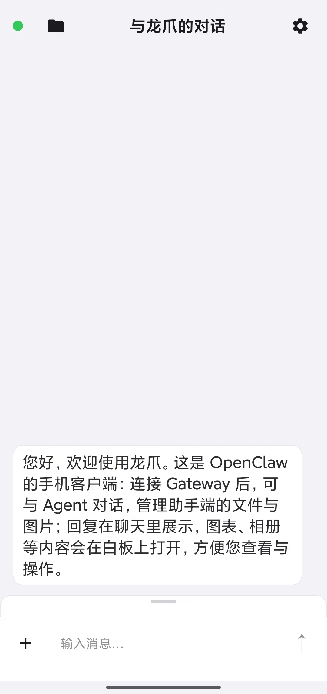
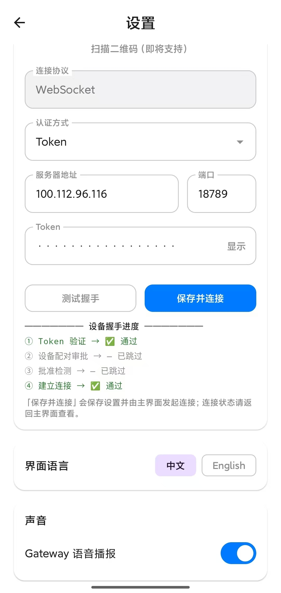
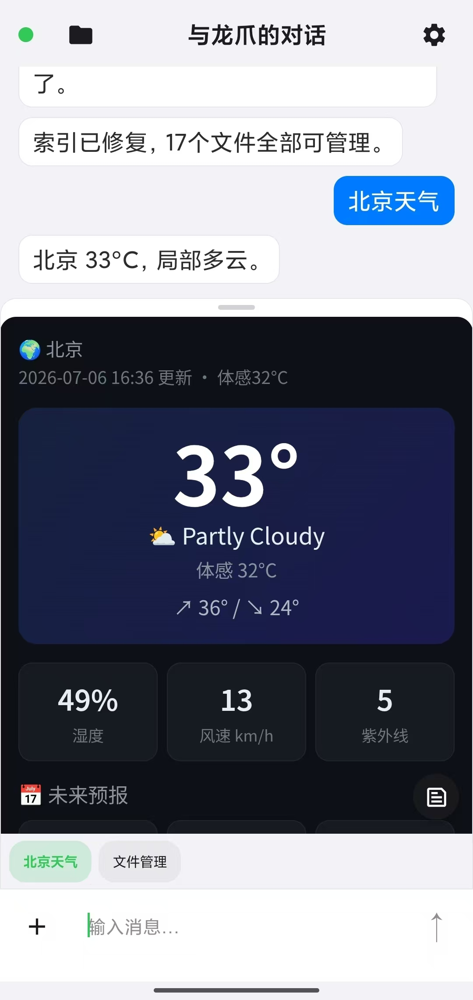
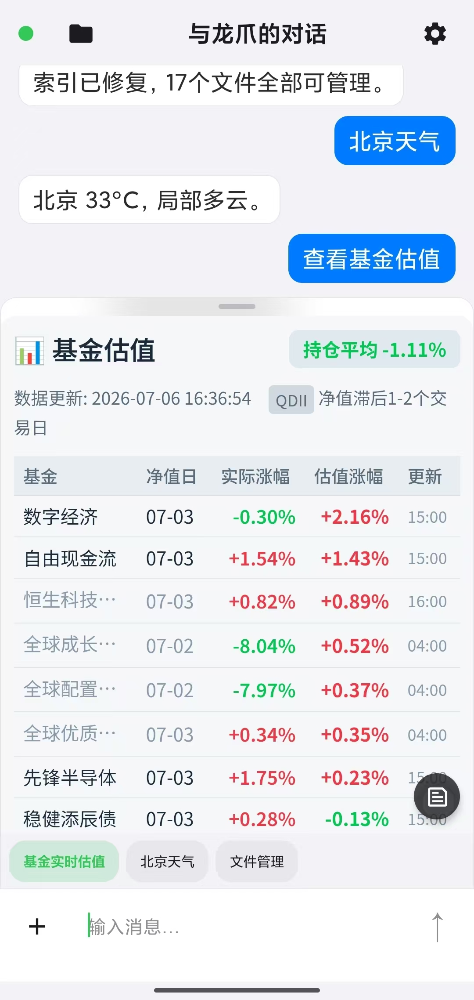
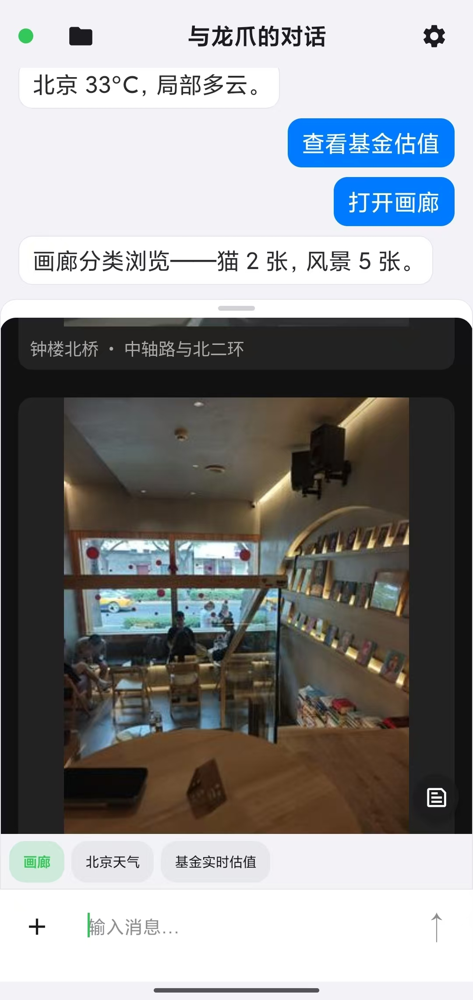
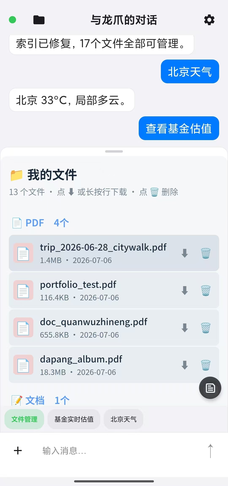

# LoongClaw Showcase — Android Client for OpenClaw Gateway

**LoongClaw** (龙爪) is a community-built **Android client** for self-hosted [OpenClaw](https://github.com/openclaw/openclaw) Gateways. Chat on your phone, render **MODAL** whiteboards (tables, WebView canvases, galleries), upload attachments, manage Gateway-side files, and hear TTS — while semantics and multimodal content stay on the Gateway.

| | |
|---|---|
| **Repository** | [laomianhua/LoongClaw-Android](https://github.com/laomianhua/LoongClaw-Android) |
| **Version** | v2.1.3 |
| **Package** | `com.littlehelper` |
| **Session** | `agent:main:main` (Gateway default main agent) |
| **License** | MIT |

---

## Screenshots (real device, v2.1.3)

| Main chat | Settings & handshake | Weather MODAL |
|:---:|:---:|:---:|
|  |  |  |

| Fund valuation board | Gallery browsing | My Files |
|:---:|:---:|:---:|
|  |  |  |

---

## Why LoongClaw?

- **Single super-assistant UX** — connects to Gateway `agent:main:main` out of the box; no Agent picker or `sessionKey` literacy required.
- **Thin client, fat Gateway** — the App is a WebSocket shell + MODAL renderer; skills, Canvas HTML, and LLM logic live on your Gateway.
- **Self-hosted first** — designed for **Tailscale / LAN `ws://`** to a home PC or NAS; credentials stay in encrypted on-device storage (not baked into the APK).
- **Companion bundle** — ships `loongclaw-gateway-bundle` zip with `littlehelper-modal` skill, reference skills (gallery, file-manager, weather, …), Canvas scripts, and `install.ps1` / `doctor.ps1` for Windows Gateway hosts.

---

## Technical highlights

| Area | What LoongClaw does |
|------|---------------------|
| **Wire protocol** | `===CHAT===` + `===MODAL===` JSON blocks; implements [OPENCLAW_GATEWAY_CONTRACT](docs/OPENCLAW_GATEWAY_CONTRACT.md) |
| **Handshake** | `client.id=openclaw-android`, `client.mode=ui`, `role=operator`; four-step **Test handshake** UI (Token → pairing → approval → connect) |
| **MODAL renderer** | Tables, Markdown, WebView Canvas (weather, charts, gallery, maps + Amap deep link); up to 6 bottom tabs |
| **Files** | Upload via Gateway sidecar `:18889`; browse/download/delete under `Download/LoongClaw/` |
| **Keep-alive** | Foreground Service + notification after Save & Connect; WebSocket heartbeat when idle (no LLM burn) |
| **Stack** | Kotlin · Jetpack Compose · encrypted settings store |

**Gateway integration points**

```
WebSocket connect → hello-ok
  → sessions.messages.subscribe
  → chat.send
  → receive chat.delta / session.message
```

MODAL example (no `===END===`):

```
===CHAT===
Beijing is 33°C, partly cloudy.

===MODAL===
{"action":"open","blocks":[{"id":"weather","type":"webview","title":"Weather",...}]}
```

---

## Quick start

### 1. Gateway host (Windows, recommended path)

1. Install [OpenClaw](https://github.com/openclaw/openclaw) (`>=2026.6.9`) and run `openclaw gateway`.
2. Install the **LoongClaw companion bundle** from [Releases](https://github.com/laomianhua/LoongClaw-Android/releases) (`loongclaw-gateway-bundle-*.zip`):
   ```powershell
   # unzip, then on the Gateway host:
   powershell -ExecutionPolicy Bypass -File .\install.ps1
   .\doctor.ps1   # all [OK] before connecting the phone
   ```
3. Start the upload sidecar (if not already running):
   ```bat
   python %USERPROFILE%\.openclaw\companion\upload_server.py
   ```

### 2. Phone

1. Install LoongClaw (Release APK or `gradlew assembleDebug`).
2. Install **Tailscale** on the same tailnet as the Gateway host.
3. **Settings** → server address (Tailscale IP e.g. `100.x.x.x`), port `18789`, Token from `gateway.auth`.
4. **Test handshake** → approve device in Control UI if prompted → **Save & Connect**.
5. Chat; ask for weather, files, gallery, etc. — Gateway skills render as MODAL boards.

### Build from source

```bat
git clone https://github.com/laomianhua/LoongClaw-Android.git
cd LoongClaw-Android
copy local.properties.example local.properties
:: set sdk.dir in local.properties
gradlew.bat assembleDebug
```

---

## Known limits (v2.1.3)

| Topic | Status |
|-------|--------|
| Public `wss://` | Not supported — use Tailscale or LAN `ws://` |
| QR scan in Settings | Placeholder only |
| Multi-agent UI | Code retained; release builds fix `agent:main:main` |
| UI language | Settings / upload / My Files support English; main chat chrome may stay Chinese |

Full docs: [README.md](README.md) · [README.zh.md](README.zh.md) · [DEVELOPER.md](docs/DEVELOPER.md)

---

## Disclaimer

LoongClaw is an **independent community client**, not affiliated with the OpenClaw project. You operate your own Gateway, tokens, and data.

**Feedback:** [laomianhua@agent.qq.com](mailto:laomianhua@agent.qq.com) · GitHub Issues on [LoongClaw-Android](https://github.com/laomianhua/LoongClaw-Android/issues)
