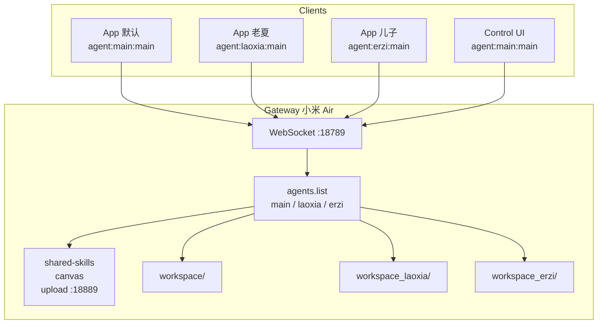
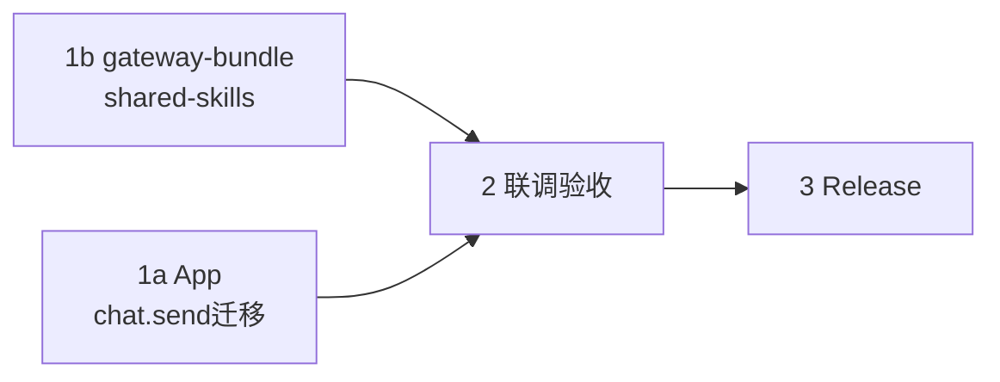

# LoongClaw 多 Agent 支持 — 完整开发规划

> **版本**：2026-07-04 rev3.1（**已落地**，2026-07-04 真机验收）  
> **状态**：v1 已完成（App 多 Agent + gateway-bundle shared-skills + chat.send/subscribe）  
> **相关契约**：[`OPENCLAW_GATEWAY_CONTRACT.md`](OPENCLAW_GATEWAY_CONTRACT.md) · [`GATEWAY_COMPANION_BUNDLE_PLAN.md`](GATEWAY_COMPANION_BUNDLE_PLAN.md) · [`multi_agent_gateway_setup.md`](multi_agent_gateway_setup.md)

### 修订记录

| 版本 | 内容 |
|------|------|
| rev2 | extraDirs 修正；统一 sessionKey；sessions.create 待确认 |
| rev3 | **连接 API**：connect → hello-ok → **chat.send**；废弃 sessions.create / sessions.send |
| **rev3.1** | **subscribe 保留**：hello-ok 后须 **sessions.messages.subscribe** 才能收 `session.message` / `chat.delta`（rev3 初稿误删，已修复） |

rev2 明细：extraDirs → `skills.load`；sessionKey 统一 `agent:{name}:main`；doctor 旧 skills WARN only。

---

## 1. 背景与目标

LoongClaw 客户端面向普通个人用户，但存在两类多 Agent 扩展场景：

| 场景 | 示例 | 需求 |
|------|------|------|
| **A. 家庭共用** | 小米 Air 上一台 Gateway，老夏和儿子各用一部手机 | 每人独立 agent、独立 workspace/会话 |
| **B. 云端衍生** | VPS 部署，多用户注册 | 每用户一个 agent，运维创建后告知 agent id |

**v1 目标**：

1. **App**：设置页新增「智能体名称」，连接时组装 `agent:{name}:main`；agent 不存在时友好报错。
2. **Gateway**：明确共享资源 vs 个人数据的边界；skill/canvas 等 LoongClaw 配套只维护一份，所有 agent 共用。
3. **gateway-bundle**：install/doctor 适配 shared-skills + `skills.load.extraDirs`。

**v1 明确不做**：单 App 多 tab 切 agent、同 agent 多 session UI、QR 扫码填 agent、运维端自动注册。

---

## 2. 端到端流程

```text
用户 A (App)          管理员 (Gateway)              Gateway
     │                      │                          │
     │ ① 申请使用           │                          │
     │─────────────────────>│                          │
     │                      │ ② agents.list 创建 agent │
     │                      │    + workspace 目录      │
     │                      │─────────────────────────>│
     │                      │ ③ 返回 agent id          │
     │                      │<─────────────────────────│
     │ ④ 告知 agent id      │                          │
     │<─────────────────────│                          │
     │ ⑤ 设置页填智能体名称   │                          │
     │ ───────────────────────────────────────────────>│
     │ ⑥ 连接成功           │                          │
     │<───────────────────────────────────────────────│
```

**家庭 Gateway 示例**：

```text
Gateway（小米 Air）
 ├─ agent:laoxia:main   ← 老夏手机，设置页填 laoxia
 └─ agent:erzi:main     ← 儿子手机，设置页填 erzi
```

---

## 3. sessionKey 规则（App ↔ Gateway 契约）

OpenClaw sessionKey 为三段式：`agent:{agentId}:{sessionId}`

### 3.1 已确认：统一策略（rev2 简化）

**所有 agent 统一使用 `agent:{name}:main`，不再对 main 使用 deviceUuid。**

| 智能体名称（App 设置） | sessionKey | 说明 |
|------------------------|------------|------|
| `main`（默认） | `agent:main:main` | 与 Control UI 共用同 agent 同会话；用户认为这样更方便 |
| `laoxia` | `agent:laoxia:main` | 家庭/云端独立 agent |
| `erzi` | `agent:erzi:main` | 同上 |

```kotlin
// SessionKeyResolver（App 新建）
object SessionKeyResolver {
    const val DEFAULT_AGENT_NAME = "main"
    const val DEFAULT_SESSION_ID = "main"

    fun resolve(agentName: String): String {
        val agent = normalizeAgentName(agentName)  // 空 → "main"
        return "agent:$agent:$DEFAULT_SESSION_ID"
    }
}
```

**与旧版 App 的差异**：此前 App 使用 `agent:main:<UUID>` 做 per-device 隔离。升级后将切到 `agent:main:main`，Gateway 侧旧 UUID 会话不再续用（本地聊天 UI 历史仍保留，Gateway 上下文为新会话）。若需 per-device 隔离，留 v2「多 session 切换」实现。

### 3.2 两层模型（v1 + 未来 v2）

```text
agent:{身份} : {会话线程}
     ↑              ↑
  v1 设置页暴露    v1 固定 main；v2 可扩展多 session
```

- **v1**：选 Agent（智能体名称）；第三段固定 `main`。
- **v2（后续）**：同一 agent 下多 session（如 `agent:laoxia:work`、「新对话」）。

### 3.3 连接顺序（✅ rev3.1 已定稿并落地）

**目标流程**（与 PC 客户端一致，2026-07-04 真机验收）：

```text
WebSocket connect → hello-ok → sessions.messages.subscribe → chat.send
  → 收 chat.delta / session.message
```

**App 迁移结果**：

```text
旧：connect → hello-ok → sessions.create → sessions.messages.subscribe → sessions.send
新：connect → hello-ok → sessions.messages.subscribe → chat.send
```

| RPC | rev3.1 状态 |
|-----|-------------|
| `chat.send` | **采用** — 发消息（含 `idempotencyKey`） |
| `sessions.messages.subscribe` | **保留** — 收推送必需 |
| `sessions.create` | **废弃** — 从 bootstrap 移除 |
| `sessions.send` | **废弃** — 改为 `chat.send` |

`chat.send` params 示例（与 [`openclaw_client_handshake_guide.md`](openclaw_client_handshake_guide.md) 对齐）：

```json
{
  "method": "chat.send",
  "params": {
    "sessionKey": "agent:laoxia:main",
    "message": "你好",
    "idempotencyKey": "<UUID>"
  }
}
```

**收消息**：连接建立后 Gateway 仍通过 WebSocket 推送 `chat.delta` / `session.message` 等事件（`GatewayEventMapper` 已支持）；无需显式 subscribe。

**握手探测**：hello-ok 后可选发一次轻量 `chat.send`（或等效探测）验证 agent 存在；agent 不存在错误在 send 阶段捕获并映射 `AGENT_NOT_FOUND`。

### 3.4 agent 命名规范

- 默认 agent id：`main`
- 多 agent 建议：用户名/昵称 + 可选序号（如 `zhangsan_01`）
- 仅字母、数字、下划线：`^[a-zA-Z0-9_]+$`
- App 保存前 trim；非法字符 inline 提示

### 3.5 需 Gateway 确认 / 联调实测项

- [x] **连接 API 路径**：`chat.send`（§3.3，PC 客户端已验证）
- [ ] agent 不存在时的错误码/文案（`chat.send` 阶段）
- [x] **`skills.load.extraDirs`**（已确认，见 §4.5）
- [ ] `agents.list` 新增 agent 后是否 hot reload，或必须重启 Gateway（§6.2）
- [ ] 新增 agent 时 workspace 最小要求：空目录是否可行，AGENTS.md 是否必须（§6.2）

---

## 4. Gateway 资源分层：共享 vs 个人

### 4.1 原则

> **LoongClaw 相关（skill / canvas / 协议）归共享；用户个人数据（memory / 持仓 / 账本）归各 agent workspace。**

### 4.2 Gateway 全局共享（配一次，所有 agent 共用）

| 项目 | 理由 |
|------|------|
| 模型配置（`agents.defaults`） | 一家人共用同一模型供应商和 API Key |
| channel 配置（微信等） | 入口统一，agent 按 label 路由 |
| skills 定义（shared-skills） | skill 是协议知识，非个人数据 |
| canvas 资产（map/leaflet/模板） | 功能组件，全 agent 相同 |
| upload_server（18889） | 文件下载服务，一个即可 |
| MCP 服务器 | 工具链共享 |

### 4.3 个人独有（每个 agent 各自一份）

| 项目 | 理由 |
|------|------|
| workspace | 各自的 AGENTS.md、MEMORY.md、记忆文件 |
| memory 数据 | 聊天记录不混 |
| portfolio/ 持仓 | 各人管各人的钱 |
| beancount/ 账本 | 各记各的账 |
| 医疗档案 | 个人病历 |
| cron 任务 | 定时需求不同 |
| workspace/skills/（可选） | 仅放该 agent 私有 skill；共享 skill 靠 extraDirs |

### 4.4 目录结构（目标态）

```text
~/.openclaw/
├── openclaw.json
├── shared-skills/              ← install 只装这里（littlehelper-modal 等）
│   └── littlehelper-modal/
│       └── SKILL.md
├── canvas/                     ← 全局共享
│   └── map.littlehelper.html
├── companion/                  ← upload sidecar 等
│   └── upload_server.py
├── workspace/                  ← main agent 工作区
│   ├── AGENTS.md
│   ├── MEMORY.md
│   └── skills/                 ← 旧路径；doctor WARN 提示迁移，不自动删
├── workspace_laoxia/           ← 老夏
│   └── skills/                 ← 可空，靠 shared-skills 补
└── workspace_erzi/             ← 儿子
    └── skills/
```

### 4.5 Gateway config 示例（✅ 已修正 extraDirs 路径）

```json
{
  "agents": {
    "defaults": {
      "model": "...",
      "workspace": "~/.openclaw/workspace"
    },
    "list": [
      { "id": "main",   "workspace": "~/.openclaw/workspace" },
      { "id": "laoxia", "workspace": "~/.openclaw/workspace_laoxia" },
      { "id": "erzi",   "workspace": "~/.openclaw/workspace_erzi" }
    ]
  },
  "skills": {
    "load": {
      "extraDirs": ["~/.openclaw/shared-skills"]
    }
  },
  "gateway": {
    "clients": {
      "allowedIds": ["openclaw-android", "loongclaw-desktop"]
    }
  }
}
```

`openclaw.merge.json` 片段（gateway-bundle 将 merge 此段）：

```json
{
  "skills": {
    "load": {
      "extraDirs": ["~/.openclaw/shared-skills"]
    }
  }
}
```

### 4.6 install 边界

- **install 负责**：shared-skills、canvas、companion sidecar、**`skills.load.extraDirs` merge**（仅此 config 片段）。
- **install 不负责**：client 白名单（由 bundle `scripts/patch_clientid` 自动 patch OpenClaw JS）、创建个人 workspace、写入 MEMORY/portfolio/beancount、覆盖已有私人数据、删除旧 workspace/skills。
- **AGENTS.md 注入**：仅 main workspace 一次；或提供 `init-agent-workspace` 模板（联调确认是否必须）。

---

## 5. App 端开发计划

### 5.1 设置页 UI

```
┌─────────────────────────────┐
│  🔗 连接设置                  │
│  Gateway 地址  [192.168.x.x]  │
│  Token         [***]          │
│  智能体名称     [main]         │  ← 新增，默认 main
│    提示：需与服务器配置一致；   │
│    家人共用 Gateway 时填管理员  │
│    分配的名称                  │
│  [测试握手]  [保存并连接]       │
└─────────────────────────────┘
```

### 5.2 改动清单

| 模块 | 文件 | 改动 |
|------|------|------|
| sessionKey 组装 | 新建 `SessionKeyResolver.kt` | 统一 `agent:{name}:main` |
| 设置模型 | `GatewayConnectionSettings.kt` | + `agentName` |
| 持久化 | `GatewaySettingsStore.kt` | + `agent_name` key |
| 配置链 | `GatewayConfigProvider.kt`、`MainViewModel.kt` | Resolver → mainSessionKey |
| UI | `GatewaySettingsSheet.kt`、`strings.xml` | 智能体名称输入框 |
| 错误映射 | `GatewayConnectErrorMapper.kt` | + `AGENT_NOT_FOUND` |
| **连接迁移** | `WebSocketOpenClawSessionClient.kt` | `sessions.send` → **`chat.send`**；保留 **`sessions.messages.subscribe`**；移除 `sessions.create` |
| RPC 常量 | `OpenClawGatewayMethods.kt` | + `CHAT_SEND`；保留 `SESSIONS_MESSAGES_SUBSCRIBE` |
| 握手探测 | `GatewayHandshakeProbe.kt` | hello-ok 后 `chat.send` 验证 agent |
| 旧 UUID 逻辑 | `AppSessionStore.kt` | **已删除**；改 `SessionKeyResolver` + 设置页 agentName |
| 文档 | `OPENCLAW_GATEWAY_CONTRACT.md` 等 | §1 多 Agent + chat.send 连接顺序 |

### 5.3 错误处理

| 阶段 | 行为 |
|------|------|
| agent 不存在 | title: 「该智能体不存在」；detail: 「请确认名称与服务器配置一致，或联系管理员」 |
| 测试握手 | hello-ok 后验证 agent（create 或 send，取决于 §3.3） |
| 切换 agent | 提示「切换智能体后将连接新的会话」；v1 不清本地聊天 |

### 5.4 测试

- `SessionKeyResolverTest` — main→`agent:main:main`、laoxia→`agent:laoxia:main`、校验
- `GatewayConnectionSettingsTest` — agentName 持久化
- `GatewayConnectErrorMapperTest` — agent not found
- `GatewayHandshakeProbeTest` — hello-ok + chat.send agent 验证
- 更新/替换 `WebSocketOpenClawSessionClientBootstrapTest` — 移除 create/subscribe 相关用例；chat.send 错误映射

### 5.5 App 与 Gateway 边界

**App 只负责「连哪个 agent」**（sessionKey 第二段 + 固定 `:main`）。  
skill 从哪加载、workspace 如何隔离 — Gateway 运行时行为，App 无感知。

---

## 6. Gateway / gateway-bundle 开发计划

### 6.1 改动清单

| 模块 | 文件 | 改动 |
|------|------|------|
| 安装目标 | `gateway-bundle/manifest.json` | `installTargets.skills` → `~/.openclaw/shared-skills` |
| 安装脚本 | `gateway-bundle/scripts/install_bundle.py` | skill 复制到 shared-skills |
| config merge | `gateway-bundle/config/openclaw.merge.json` | 追加 **`skills.load.extraDirs`** |
| 健康检查 | `gateway-bundle/scripts/doctor_bundle.py` | 检查 shared-skills；**WARN** 旧 workspace/skills 副本 |
| 多 agent 文档 | 新建 `docs/multi_agent_gateway_setup.md` | 家庭 Gateway 搭建步骤 |
| skill 镜像 | `scripts/skills/littlehelper-modal/SKILL.md` | 多 agent sessionKey 说明 |

### 6.2 新增 agent 操作手册（管理员向）

1. 在 `openclaw.json` 的 `agents.list` 追加 `{ "id": "laoxia", "workspace": "~/.openclaw/workspace_laoxia" }`
2. 创建目录 `~/.openclaw/workspace_laoxia/`（**联调确认**：空目录是否足够，AGENTS.md 是否必须）
3. **联调确认**：热加载生效，或写「修改 agents.list 后重启 Gateway」
4. 告知用户 agent id = `laoxia`
5. **无需**复制 littlehelper-modal — shared-skills + extraDirs 自动可见

### 6.3 现有用户迁移

| 对象 | 策略 |
|------|------|
| Gateway `workspace/skills/littlehelper-modal/` | doctor **WARN**：建议手动迁移到 shared-skills；**不自动删除** |
| App 旧 sessionKey `agent:main:<UUID>` | 升级后改为 `agent:main:main`；Gateway 旧 UUID 会话不续用 |

---

## 7. 整体架构



App 默认 `main` 与 Control UI 共享 `agent:main:main`（rev2 有意为之）。

---

## 8. 实施顺序与依赖



| 批次 | 内容 | 负责 | 依赖 |
|------|------|------|------|
| **1a. App** | SessionKeyResolver、设置页、**chat.send 迁移**、错误映射、握手探测、测试 | App | 连接 API ✅ |
| **1b. Bundle** | shared-skills 安装、merge 片段、doctor WARN、setup 文档 | App repo | extraDirs ✅ |
| **2. 联调** | laoxia + erzi 双手机；agent 不存在；MODAL 路由；main 与 Control UI 共会话；hot reload / 空 workspace | 双方 | 1a + 1b |
| **3. Release** | 契约定稿、bundle zip + APK 同 tag | App repo | 2 |

**1a 与 1b 可立即并行开工。**

---

## 9. 风险与边界

| 风险 | 缓解 |
|------|------|
| chat.send 与旧 sessions.send 参数差异 | 对齐 PC 客户端与 handshake guide；联调验证 |
| 移除 subscribe 后收消息异常 | PC 已验证；保留 GatewayEventMapper 对 chat.delta / session.message 的处理 |
| App 从 UUID 切到 main:main，旧 Gateway 会话丢失 | Release note 说明；v2 多 session 可恢复 per-device 隔离 |
| 同 agent 多设备共享 `agent:{name}:main` | 文档说明；v2 多 session |
| agents.list 不支持 hot reload | setup 文档写重启步骤 |
| 旧 workspace/skills 重复 | doctor WARN only，不自动删 |
| 空 workspace 不可用 | 联调后更新 setup 文档最小初始化要求 |

---

## 10. Gateway 对齐检查清单

- [x] `skills.load.extraDirs` 路径
- [x] 连接 API：`chat.send`（PC 已验证；App 迁移见 §3.3）
- [ ] agent 不存在错误格式（`chat.send` 阶段）
- [ ] `agents.list` + 独立 workspace 是否为推荐多 agent 配法
- [ ] shared-skills 对所有 agent 可见且优先级正确
- [ ] channel 多 agent 路由
- [ ] upload_server :18889 全局即可
- [ ] 新增 agent：空 workspace 是否可行；AGENTS.md 是否必须
- [ ] agents.list 变更是否需重启 Gateway
- [ ] App `agent:main:main` 与 Control UI 共会话的行为可接受

---

## 11. 确认后开工项

**App 批次**：

1. `SessionKeyResolver`（统一 `agent:{name}:main`）
2. `GatewayConnectionSettings` / Store / UI
3. **`WebSocketOpenClawSessionClient` 迁移至 chat.send**；移除 sessions.create/subscribe/send
4. `GatewayConnectErrorMapper` + HandshakeProbe（chat.send 验证 agent）
5. 废弃 `AppSessionStore` UUID sessionKey
6. 单元测试 + `assembleDebug` + 契约文档

**Gateway 批次**（extraDirs 已确认，可先行）：

1. `manifest.json` + `install_bundle.py` → shared-skills
2. `openclaw.merge.json` → **`skills.load.extraDirs`**
3. `doctor_bundle.py` → shared-skills 检查 + 旧 skills WARN
4. `docs/multi_agent_gateway_setup.md`

---

*文档维护：LittleHelper / LoongClaw App 仓库 · rev3 连接 API 定稿（chat.send）*
